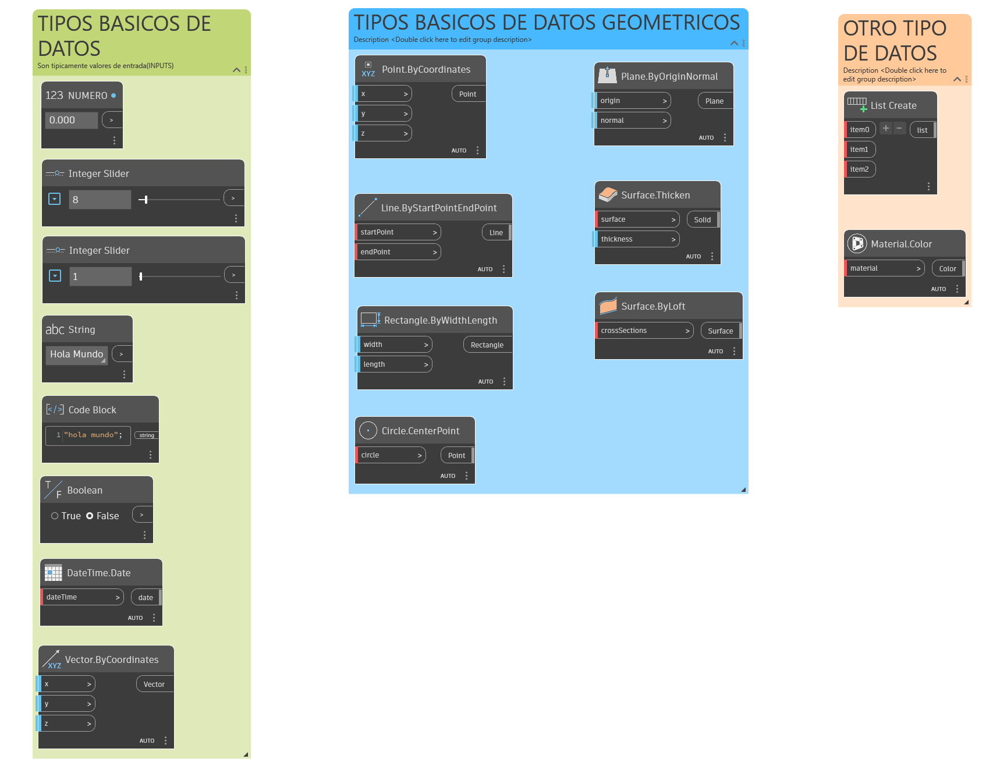

# Ejercicio 2: Catálogo de Tipos de Datos

## 1. ESQUEMA DE TRABAJO

---

### 2. OBJETIVO DEL EJEMPLO
El objetivo de esta sesión es identificar, clasificar y diferenciar los distintos tipos de información y variables lógicas que se manipulan dentro del entorno de Dynamo para Revit 2026. Comprender esta taxonomía es fundamental para evitar errores de compatibilidad en los puertos de conexión de scripts futuros.

---

### 3. EXPLICACION
La imagen muestra una clasificación modular dividida en tres grandes familias estructuradas por colores:

*   **Tipos Básicos de Datos (Bloque Verde):** Son los valores alfanuméricos de entrada obligatorios. Incluye datos numéricos simples (`NUMERO`, `Integer Slider`), cadenas de texto (`String` o declaradas mediante sintaxis entre comillas en un `Code Block`), variables lógicas condicionales (`Boolean` con opciones *True/False*), marcas temporales (`DateTime.Date`) y componentes vectoriales de dirección (`Vector.ByCoordinates`).
*   **Tipos Básicos de Datos Geométricos (Bloque Azul):** Representan entidades espaciales abstractas y tridimensionales dentro del motor informático. Contempla desde el punto elemental (`Point.ByCoordinates`), líneas definidas por vectores de inicio y fin (`Line`), figuras planas en planos bidimensionales (`Rectangle`, `Circle`) hasta superficies complejas e infinitas (`Plane`) y sólidos tridimensionales con propiedades físicas de grosor (`Surface.Thicken`, `Surface.ByLoft`).
*   **Otros Tipos de Datos (Bloque Naranja):** Contenedores avanzados y propiedades gráficas abstractas. Destaca el nodo `List Create`, herramienta primordial para agrupar múltiples elementos u objetos bajo índices numéricos ordenados, y el nodo `Material.Color`, utilizado para asignar valores de diseño cromático (RGB) a los elementos del script.

---

### 4. RECOMENDACIONES
*   **Inspección de Puertos:** En Dynamo para Revit 2026, posa el cursor durante un segundo sobre cualquier puerto de entrada de un nodo. El programa desplegará un cuadro de texto indicándote el tipo de dato exacto que requiere recibir.
*   **Errores de Conexión:** Si conectas un tipo de dato incompatible (por ejemplo, pasar un dato de tipo *String* / Texto a un puerto que exige un *Point* / Geometría), el cable de conexión se tornará de color rojo y el nodo receptor se desactivará mostrando una advertencia amarilla.
