# Listas y estructuras de datos basica en Dynamo 

## Tabla de contenidos

- [Listas y estructuras de datos basica en Dynamo](#listas-y-estructuras-de-datos-basica-en-dynamo)
  - [Tabla de contenidos](#tabla-de-contenidos)
  - [1. Introducción](#1-introducción)
  - [2. Conceptos fundamentales](#2-conceptos-fundamentales)
    - [2.1 ¿Qué es una lista?](#21-qué-es-una-lista)
    - [2.2 Índices basados en cero](#22-índices-basados-en-cero)
    - [2.3 Entradas y salidas: cómo cada nodo interpreta una lista](#23-entradas-y-salidas-cómo-cada-nodo-interpreta-una-lista)
  - [3. Proceso: operaciones básicas de lista](#3-proceso-operaciones-básicas-de-lista)
    - [3.1 Crear una lista](#31-crear-una-lista)
    - [3.2 List.Count — contar elementos](#32-listcount--contar-elementos)
    - [3.3 List.GetItemAtIndex — consultar un elemento](#33-listgetitematindex--consultar-un-elemento)
    - [3.4 List.Reverse — invertir el orden](#34-listreverse--invertir-el-orden)
    - [3.5 List.ShiftIndices — desplazar elementos](#35-listshiftindices--desplazar-elementos)
    - [3.6 List.FilterByBooleanMask — filtrar elementos](#36-listfilterbybooleanmask--filtrar-elementos)
    - [3.7 Verificar que funcionó](#37-verificar-que-funcionó)
  - [4. Encaje de listas (Lacing)](#4-encaje-de-listas-lacing)
  - [5. Listas de listas y jerarquía de datos](#5-listas-de-listas-y-jerarquía-de-datos)
    - [5.1 Jerarquía descendente](#51-jerarquía-descendente)
    - [5.2 Flatten  — aplanar la jerarquía](#52-flatten---aplanar-la-jerarquía)
    - [5.3 Chop — dividir una lista en sublistas](#53-chop--dividir-una-lista-en-sublistas)
    - [5.4 List.Map y List.Combine](#54-listmap-y-listcombine)
    - [5.5 List@Level — seleccionar el nivel directamente](#55-listlevel--seleccionar-el-nivel-directamente)
    - [5.6 List.Transpose — intercambiar filas y columnas](#56-listtranspose--intercambiar-filas-y-columnas)
  - [6. Otras operaciones de lista que conviene conocer](#6-otras-operaciones-de-lista-que-conviene-conocer)
  - [7. Aplicaciones prácticas en Revit](#7-aplicaciones-prácticas-en-revit)
  - [8. Ejemplo de aplicación: fila de columnas con nombres automáticos (parámetro Mark)](#8-ejemplo-de-aplicación-fila-de-columnas-con-nombres-automáticos-parámetro-mark)
  - [9. Solución de problemas](#9-solución-de-problemas)
  - [10. Próximos pasos](#10-próximos-pasos)

## 1. Introducción

Esta guía explica cómo funcionan las **listas** en Dynamo: qué son, cómo se consultan y modifican, cómo se relacionan varias listas entre sí mediante el *encaje* (lacing), y cómo trabajar con estructuras más complejas como listas de listas y datos de n dimensiones. Al terminarla vas a poder crear, consultar, filtrar y reorganizar listas con confianza, y aplicar ese conocimiento a la generación paramétrica de elementos en Revit (columnas, familias, paneles, niveles).

**Prerrequisitos:**

- Dynamo 2.x instalado (incluido con Revit 2020 en adelante, o como Dynamo Sandbox independiente).
- Conocimientos básicos de la interfaz de Dynamo: crear nodos, conectar cables, usar *Code Block*.
- Se recomienda —pero no es obligatorio— haber revisado antes los conceptos de puntos, vectores y curvas, ya que se usan como ejemplos a lo largo de la guía.

> **Nota:** todos los ejemplos funcionan igual en Dynamo Sandbox y en Dynamo for Revit. La [sección 7](#7-aplicaciones-prácticas-en-revit) cubre las particularidades de Revit.

## 2. Conceptos fundamentales

### 2.1 ¿Qué es una lista?

Una **lista** es un conjunto de elementos o *items*. Piensa en un racimo de plátanos: cada plátano es un elemento de la lista. Es más fácil manipular el racimo completo que cada plátano por separado, y lo mismo ocurre al agrupar elementos por relaciones paramétricas en una estructura de datos.

Si además metes varios racimos en una bolsa, esa bolsa también es una lista — pero de racimos. Este es el primer indicio de las **listas de listas** (bidimensionales), que se tratan en la [sección 5](#5-listas-de-listas-y-jerarquía-de-datos).


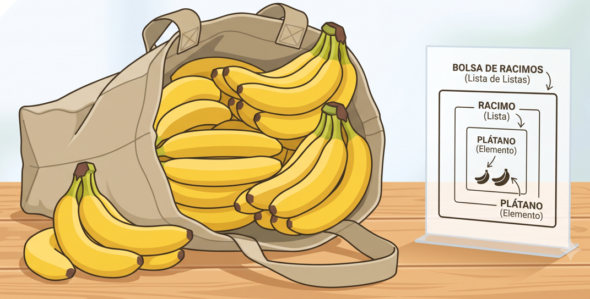

Los elementos de una lista no tienen por qué ser números: pueden ser puntos, curvas, superficies, familias, o cualquier otro tipo de dato compatible con Dynamo.

### 2.2 Índices basados en cero

El primer elemento de cualquier lista en Dynamo tiene siempre el índice **0**, no 1. Si contaras los dedos de tu mano derecha normalmente dirías "1, 2, 3, 4, 5", pero si los pusieras en una lista de Dynamo, sus índices irían de **0 a 4**.

> **Nota:** aunque resulte extraño al principio, el índice de base cero es una práctica estándar en la mayoría de los lenguajes y sistemas de cálculo (Python, C#, JavaScript, etc.), así que acostumbrarte a esto en Dynamo también te ayuda fuera de él.

La forma más sencilla de inspeccionar los datos de una lista es conectar un nodo `Watch` a la salida de otro nodo: por defecto, `Watch` muestra los índices a la izquierda y los elementos de datos a la derecha.

### 2.3 Entradas y salidas: cómo cada nodo interpreta una lista

No todos los nodos tratan una misma lista de la misma forma. Por ejemplo, si conectas una lista de cinco puntos a dos nodos distintos:

- `PolyCurve.ByPoints` busca una entrada `points` de tipo `Point[]` (una lista completa) y **condensa** toda la lista en una única PolyCurve.
- `Circle.ByCenterPointRadius` busca una entrada `centerPoint` de tipo `Point` (un elemento individual), así que Dynamo **repite la operación** una vez por cada punto, generando cinco círculos.

Pasar el cursor sobre una entrada de un nodo te muestra el tipo de dato esperado: si aparecen corchetes al final (`Point[]`), la entrada espera una lista; si no, espera un elemento individual. Reconocer esta diferencia es clave para entender por qué un mismo dato de entrada produce resultados tan distintos según el nodo al que se conecte.

## 3. Proceso: operaciones básicas de lista

### 3.1 Crear una lista

Hay varias formas de crear una lista en Dynamo:

- **Con un `Code Block`**, usando corchetes: `[0,1,2,3,4];` crea una lista de cinco números directamente. Esta es la forma más rápida y compacta.
- **Con el nodo `List.Create`**, que recibe cualquier número de entradas y las agrupa en una lista — útil cuando cada elemento viene de un nodo distinto.
- **Como resultado de otro nodo**, cuando ese nodo entrega naturalmente varios valores (por ejemplo, `Curve.PointAtParameter` con varios parámetros de entrada).

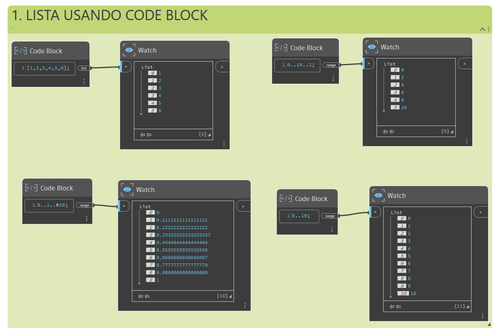

### 3.2 List.Count — contar elementos

`List.Count` cuenta el número de valores de una lista y devuelve ese número. Es sencillo con listas simples, pero se comporta de forma distinta con listas de listas (ver [sección 5](#5-listas-de-listas-y-jerarquía-de-datos)).


```
Lista de entrada ──> List.Count ──> Watch (número de elementos)
```

### 3.3 List.GetItemAtIndex — consultar un elemento

`List.GetItemAtIndex` es la forma fundamental de consultar un elemento específico de una lista mediante su índice.

1. Conecta tu lista a la entrada `list`.
2. Conecta un número (por ejemplo, desde un `Code Block`) a la entrada `index`.


> **⚠️ Advertencia:** si el índice solicitado es mayor o igual al número de elementos de la lista (recuerda que el conteo empieza en 0), Dynamo devolverá un error. Usa `List.Count` para verificar el tamaño antes de consultar un índice calculado dinámicamente.

También puedes consultar un elemento con la sintaxis abreviada de *Code Block*: `lista[2];` devuelve el elemento en el índice 2, exactamente igual que `List.GetItemAtIndex`.

### 3.4 List.Reverse — invertir el orden

`List.Reverse` invierte el orden de todos los elementos de una lista. Si tenías `[A, B, C, D, E, F]`, obtienes `[F, E, D, C, B, A]`.

Este nodo es especialmente útil cuando conectas dos listas de puntos para generar líneas o superficies regladas: invertir una de las dos listas antes de conectarlas cambia por completo la geometría resultante (de líneas paralelas a una forma tipo "hiperboloide" o de silla de montar).


### 3.5 List.ShiftIndices — desplazar elementos

`List.ShiftIndices` desplaza los elementos de una lista un número determinado de posiciones, haciendo que "den la vuelta" (el último elemento pasa a ocupar el primer lugar, y así sucesivamente). Es una herramienta muy útil para crear **patrones helicoidales o de torsión**.


Un valor de desplazamiento pequeño (por ejemplo, 1) produce una torsión sutil; un valor mayor (por ejemplo, 30, en una lista de 100 elementos) produce una torsión mucho más pronunciada — el mismo principio que usan los generadores paramétricos de fachadas trenzadas o columnas estriadas.

### 3.6 List.FilterByBooleanMask — filtrar elementos

`List.FilterByBooleanMask` elimina o conserva elementos de una lista según una lista paralela de valores `True`/`False` (la "máscara").

1. Genera una lista de valores booleanos del mismo tamaño que tu lista original — por ejemplo, usando el operador módulo (`%`) para marcar como `True` los índices divisibles entre 4.
2. Conecta tu lista original a la entrada `list` y la máscara a la entrada `mask`.
3. La salida `in` contiene los elementos donde la máscara era `True`; la salida `out` contiene los elementos donde era `False`.


> **Nota:** este patrón —generar índices, aplicar módulo, comparar con `==`— es la forma estándar de crear patrones periódicos (por ejemplo, "selecciona uno de cada cuatro paneles") sin necesidad de escribir la lista de booleanos a mano.

### 3.7 Verificar que funcionó

- Conecta siempre un nodo `Watch` (o `Watch3D` para geometría) a la salida de cada operación mientras aprendes; te permite confirmar visualmente el resultado antes de seguir encadenando nodos.
- Si `List.Count` no devuelve el número que esperabas, probablemente estás trabajando con una lista de listas y el conteo se está aplicando al nivel equivocado de la jerarquía (ver [sección 5.1](#51-jerarquía-descendente)).
- Si `List.FilterByBooleanMask` da un error de tamaño, verifica que la lista y la máscara tengan exactamente el mismo número de elementos.

## 4. Encaje de listas (Lacing)

El **encaje** (*lacing*) resuelve un problema muy concreto: ¿qué debe hacer Dynamo cuando un nodo recibe dos o más listas de **distinto tamaño** en sus entradas? La correspondencia de datos no tiene una única solución correcta — el algoritmo de encaje que elijas puede dar resultados muy distintos.

Las opciones de encaje se encuentran haciendo clic con el botón derecho en el centro de un nodo, en el menú **"Encaje"**.

| Algoritmo | Comportamiento | Cuándo usarlo |
|---|---|---|
| **Más corto** (*Shortest*, por defecto) | Conecta las entradas una a una hasta que el flujo más corto se agota. | Cuando quieres una correspondencia 1 a 1 entre dos listas del mismo tamaño lógico (por ejemplo, puntos de inicio y fin de una serie de líneas). |
| **Más largo** (*Longest*) | Sigue conectando, repitiendo el último elemento de la lista más corta hasta que la más larga se agote. | Cuando una lista es intencionalmente más corta y quieres que su último valor se "estire" para cubrir el resto. |
| **Producto cartesiano** (*Cross Product*) | Genera todas las combinaciones posibles entre los elementos de ambas listas. | Cuando necesitas una rejilla completa (por ejemplo, todas las combinaciones de X e Y para generar una malla de puntos). |

**Ejemplo con dos listas** — una lista de 6 elementos (índices 0–5) y otra de 11 elementos (índices 0–10), conectadas a un nodo `Point.ByCoordinates` y luego a `Line.ByStartPointEndPoint`:

- Con **Más corto**, obtienes 5 puntos: una línea diagonal simple que se detiene en cuanto la lista más corta se agota.
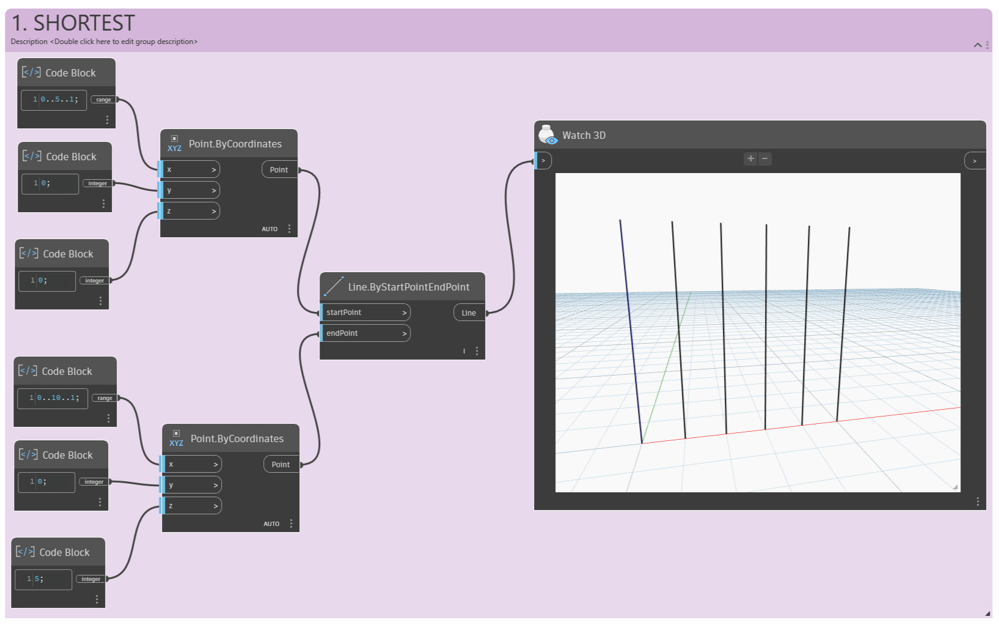
- Con **Más largo**, obtienes 11 puntos: la diagonal continúa y el último valor de la lista de 6 se repite para las 5 posiciones sobrantes.
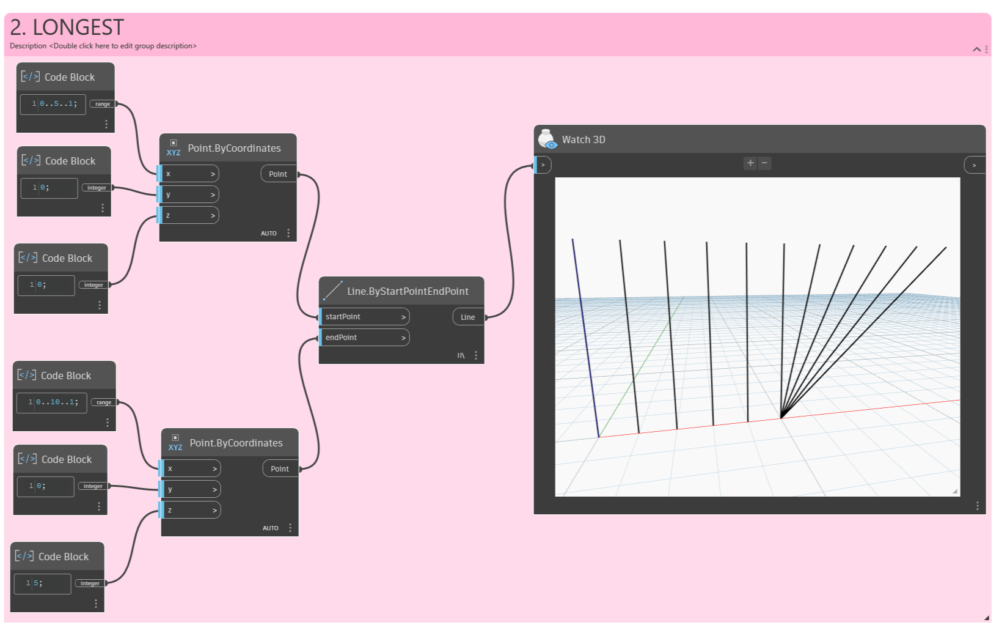
- Con **Producto cartesiano**, obtienes una rejilla completa de 6 × 11 = 66 combinaciones — el resultado ya no es una lista simple, sino una **lista de listas**.
  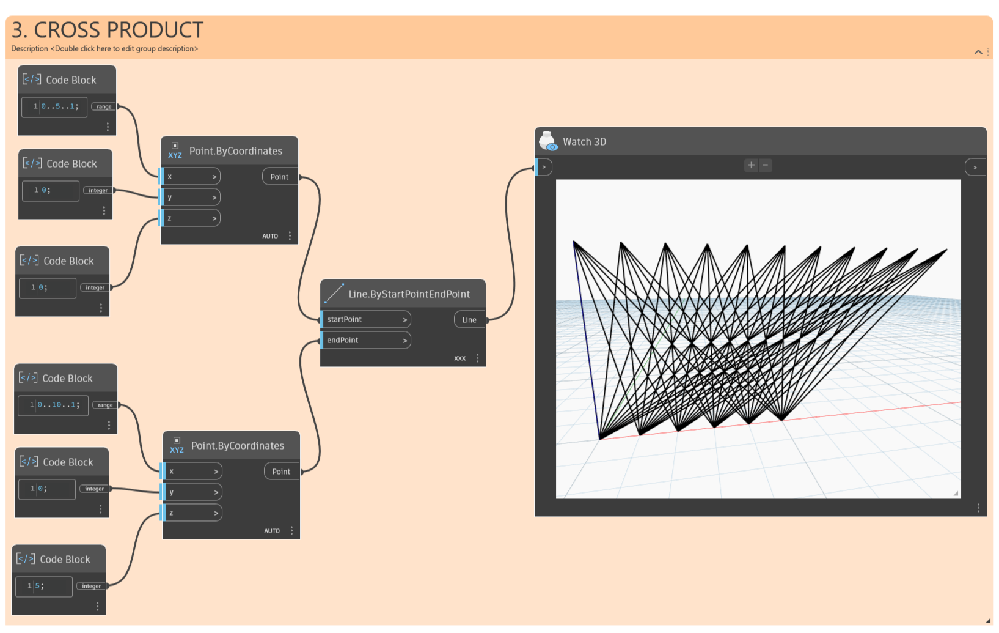

> **⚠️ Advertencia:** el producto cartesiano crece muy rápido. Combinar dos listas de 100 elementos cada una genera 10.000 combinaciones. En modelos de Revit con mucha geometría, esto puede volver el gráfico lento — usa `List.Chop` o filtra antes de generar geometría pesada sobre una rejilla tan grande.

## 5. Listas de listas y jerarquía de datos

### 5.1 Jerarquía descendente

Si usas la baraja de cartas del ejemplo original y agrupas varias barajas en un cuadro, ese cuadro representa ahora una **lista de barajas**, y cada baraja es una lista de cartas. Esta es una **lista de listas**.

  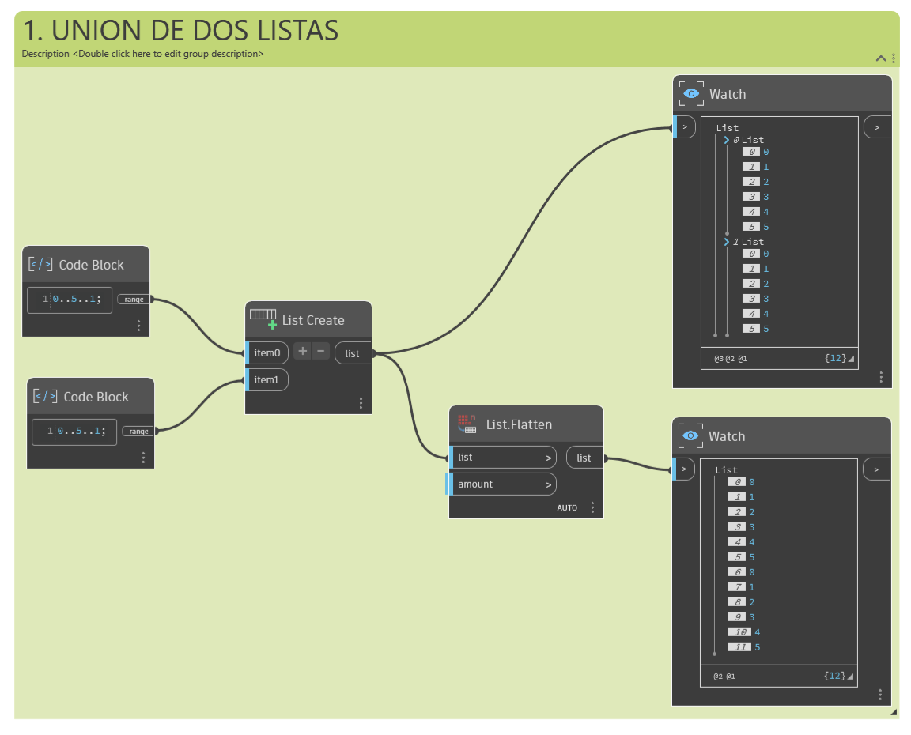

El concepto clave: **Dynamo trata las listas como objetos en sí mismos**. Esta jerarquía descendente se basa en programación orientada a objetos: en lugar de seleccionar directamente un subelemento con `List.GetItemAtIndex`, Dynamo primero selecciona ese índice en la lista *principal*, y el resultado puede ser, a su vez, otra lista.

Por ejemplo, si `List.GetItemAtIndex` se usa con índice `0` sobre una lista de listas, Dynamo selecciona la **primera lista completa** y todo su contenido — no el primer elemento individual de toda la estructura.

### 5.2 Flatten  — aplanar la jerarquía

**Flatten** elimina todos los niveles de una estructura de datos, convirtiendo una lista de listas en una única lista plana. Es útil cuando la jerarquía ya no aporta valor a la operación siguiente, pero puede ser **peligroso** porque descarta información sobre cómo estaban agrupados los datos.

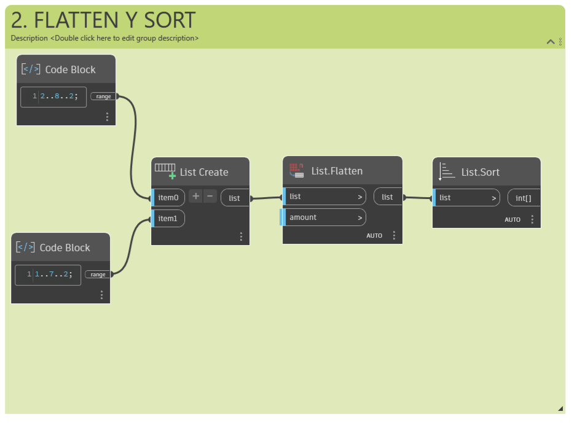

Un ejemplo típico: si tienes una rejilla de puntos (lista de listas, una por fila) y la conectas directamente a `PolyCurve.ByPoints`, obtienes una curva por fila. Si insertas `Flatten` antes, obtienes todos los puntos en una única lista, y `PolyCurve.ByPoints` genera una sola curva.

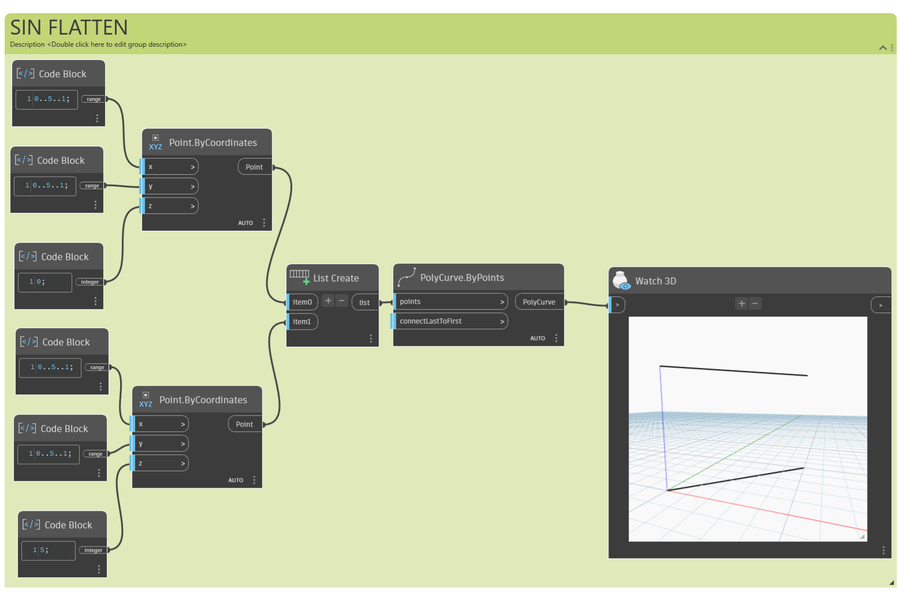

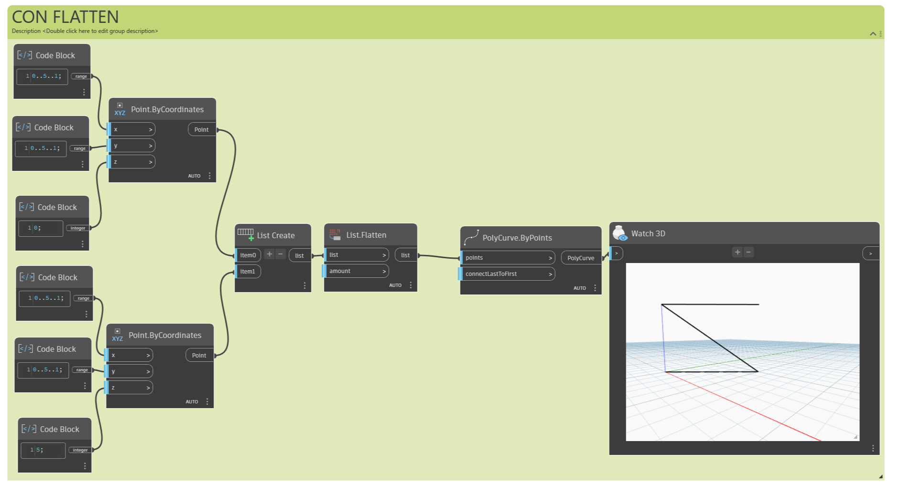

Si necesitas más control, usa el nodo `List.Flatten`, que permite indicar **cuántos niveles** aplanar desde arriba de la jerarquía, en vez de aplanarla por completo. Esto es especialmente útil en estructuras de datos complejas donde solo quieres colapsar los dos niveles superiores, por ejemplo, y conservar el resto intacto.

### 5.3 Chop — dividir una lista en sublistas

`List.Chop` hace justo lo contrario de `Flatten`: en vez de eliminar niveles, **añade** un nivel nuevo, dividiendo una lista plana en sublistas de un tamaño fijo.

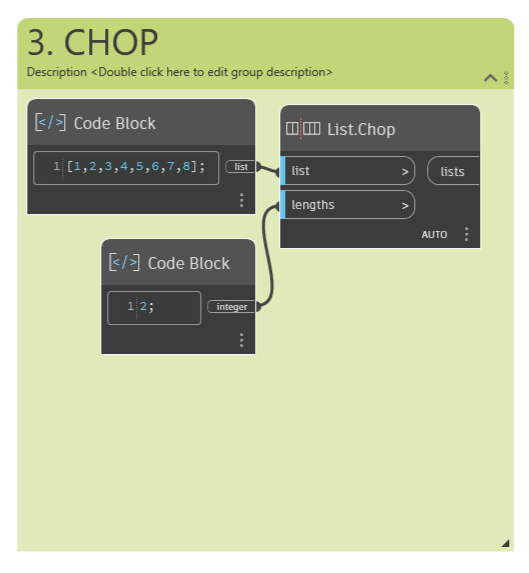

Por ejemplo, `List.Chop` con un valor de `2` sobre una lista de 8 elementos produce 4 sublistas de 2 elementos cada una. Es una herramienta útil para operaciones geométricas: dividir una serie de puntos a lo largo de una curva en pares, tríos, o cualquier agrupación que necesite tu lógica de diseño (por ejemplo, agrupar puntos de tres en tres para generar arcos).

### 5.4 List.Map y List.Combine

`List.Map` y `List.Combine` aplican una función a una lista de entradas, pero **un nivel hacia abajo en la jerarquía** respecto a como actuaría el nodo normalmente.

- **List.Map** usa **una** lista de entrada. Por ejemplo, si conectas `List.Count` (sin ninguna entrada conectada directamente) como la función `f(x)` de `List.Map`, y la lista de entrada es una lista de 5 listas con 3 elementos cada una, el resultado es una lista de 5 valores — el conteo de cada sublista individual, no el conteo de la lista principal.
- 
  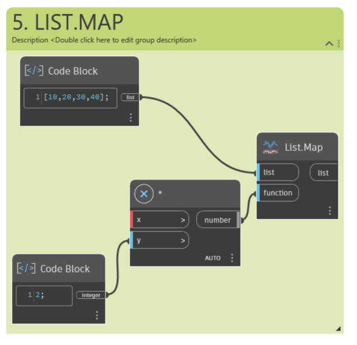

- **List.Combine** funciona igual, pero acepta **varias listas de entrada correspondientes**, útil cuando la función que quieres aplicar (el "combinador") necesita más de un argumento por cada nivel de la jerarquía — por ejemplo, dividir cada línea de una lista por un número de puntos distinto, tomado de otra lista paralela.

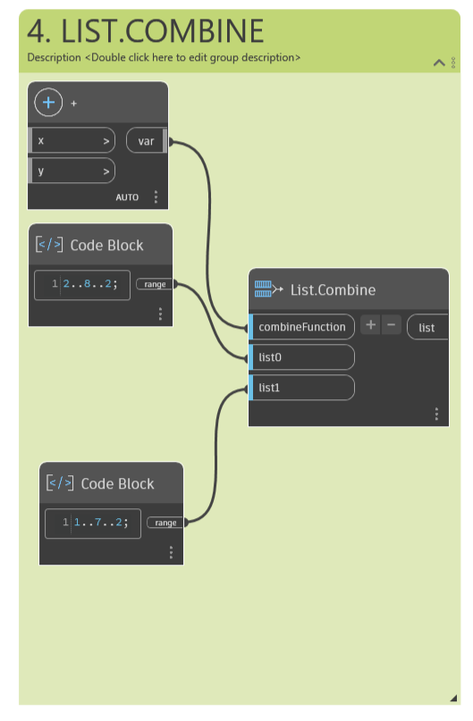

> **⚠️ Advertencia:** al usar `List.Combine`, las entradas vacías del nodo "combinador" deben rellenarse **en el mismo orden** en que se conectan las listas a `List.Combine`, y hay que desactivar "Utilizar valor por defecto" en cualquier entrada del combinador que tenga un valor predeterminado, o el resultado será incorrecto.

### 5.5 List@Level — seleccionar el nivel directamente

`List@Level` es una alternativa más directa a `List.Map` para trabajar con niveles de jerarquía. En vez de anidar nodos `List.Map`, permite seleccionar el nivel de lista deseado directamente en el puerto de entrada de **cualquier** nodo.

1. Haz clic en el símbolo `>` junto a una entrada del nodo.
2. Activa **"Utilizar niveles"** y elige el nivel (`L1`, `L2`, `L3`...) sobre el que quieres que opere el nodo.
3. Opcionalmente, activa **"Mantener la estructura de listas"** si quieres conservar la organización de sublistas en la salida, en vez de aplanarla.

> **Nota:** los niveles se numeran en orden inverso: el nivel más profundo de la jerarquía siempre es `L1`, independientemente de cuántos niveles tenga la estructura completa por encima. Esto asegura que tus gráficos sigan funcionando aunque cambies la profundidad de los niveles superiores.

`List@Level` y `List.Map` pueden llegar al mismo resultado, pero `List@Level` es más rápido de configurar para casos simples; `List.Map`/`List.Combine` siguen siendo más flexibles cuando la lógica de la función es compleja o cuando se necesita anidar varios niveles de mapeo (por ejemplo, `List.Map` dentro de otro `List.Map` para bajar dos niveles a la vez).

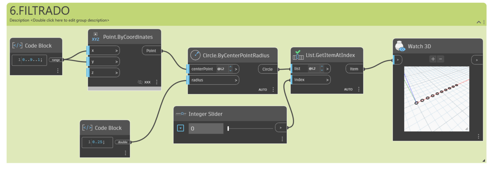

### 5.6 List.Transpose — intercambiar filas y columnas

`List.Transpose` funciona exactamente como una transposición en una hoja de cálculo: intercambia las filas y las columnas de una lista de listas. Una matriz de 11 elementos cada una se convierte en 11 listas con 1 elementos cada una.

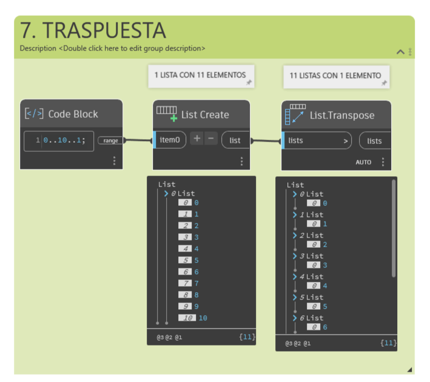

Aplicado a geometría, transponer una rejilla de puntos antes de conectarla a `PolyCurve.ByPoints` cambia la dirección en la que se generan las curvas: de curvas "horizontales" a curvas "perpendiculares" a las originales. Es la base para construir **estructuras con nervios** (por ejemplo, una superficie con curvas guía en ambas direcciones, como una cáscara reticulada).

> **⚠️ Advertencia:** `List.Transpose` solo intercambia el nivel superior de listas — no invierte el contenido interno de listas más profundas. En una estructura de **tres** niveles (listas 3D), transponer el nivel superior no reordena automáticamente el nivel inferior; para eso necesitas combinar `List.Transpose` con `List.Map` (aplicando la transposición un nivel más abajo) o usar `List.Combine`, que suele ser más fiable en jerarquías complejas.

## 6. Otras operaciones de lista que conviene conocer

Más allá de lo cubierto en las secciones anteriores, estos nodos resuelven necesidades muy comunes en flujos de trabajo reales:

- **`List.Clean`**: elimina de una lista los valores nulos y, opcionalmente, las listas vacías. Muy útil después de filtrar datos importados de Revit, donde algunos elementos pueden no tener el parámetro solicitado.
- **`List.DropItems` / `List.TakeItems`**: descartan o conservan un número determinado de elementos desde el inicio (o el final, con un índice negativo) de una lista — útil para "recortar" los extremos de una serie de puntos.
- **`List.SortByKey`**: ordena una lista según los valores de otra lista paralela (la "clave"). Por ejemplo, ordenar una lista de familias según su distancia a un punto de referencia.
- **`List.GroupByKey`**: agrupa los elementos de una lista en sublistas según una clave compartida — por ejemplo, agrupar elementos de Revit por el valor de un parámetro (nivel, tipo, fase).
- **`List.AllIndicesOf`**: devuelve todos los índices en los que aparece un valor determinado dentro de una lista, útil para localizar coincidencias sin recorrer la lista manualmente.
- **`List.Join`**: concatena dos o más listas en una sola, una a continuación de la otra (a diferencia de `List.Create`, que las anida como sublistas).
- **`List.UniqueItems`**: devuelve una lista sin elementos duplicados — útil para depurar listas de parámetros de tipo o de niveles de proyecto.
- **`List.Equals`**: compara dos listas y devuelve si son idénticas en contenido y orden; sirve para validar que dos flujos de datos paralelos siguen sincronizados antes de combinarlos.

> **Nota:** casi todas estas operaciones tienen un nodo análogo en la categoría `List` del explorador de Dynamo. Si necesitas una operación de lista y no la encuentras aquí, es muy probable que exista un nodo nativo — busca primero antes de reconstruirla manualmente con `Code Block`.

## 7. Aplicaciones prácticas en Revit

Las listas dejan de ser abstractas en cuanto pasan a controlar elementos reales del modelo:

- **Distribución paramétrica de familias**: generar una lista de puntos (con lacing de producto cartesiano) y usarla como entrada de `FamilyInstance.ByPoint` para colocar mobiliario, luminarias o columnas en toda una rejilla de una sola vez.
- **Parámetros por elemento**: usar `List.Map` o `List@Level` para asignar un valor de parámetro distinto a cada instancia de una lista de elementos de Revit (por ejemplo, variar la altura de una serie de paneles según su posición).
- **Selección y filtrado de elementos existentes**: combinar `List.FilterByBooleanMask` con una consulta de parámetros (por ejemplo, "todas las puertas cuyo ancho sea mayor a 90 cm") para aislar un subconjunto de elementos sobre el que aplicar una operación.
- **Agrupación por nivel o fase**: usar `List.GroupByKey` sobre los elementos de un proyecto para generar tablas de cantidades personalizadas o exportar datos organizados por nivel.
- **Generación de nervios y estructuras regladas**: `List.Transpose` y `List.Chop` son la base de flujos de trabajo que generan estructuras de cubierta, fachadas paramétricas o falsos techos con nervaduras a partir de superficies importadas o modeladas en Dynamo.
- **Sincronización de datos externos**: al importar datos desde Excel o CSV (por ejemplo, una lista de ubicaciones y tipos de familia), las listas resultantes casi siempre requieren `List.Transpose` o `List.Chop` para pasar de "una fila por registro" a "una lista por campo", según lo que necesite cada nodo de Revit.

## 8. Ejemplo de aplicación: fila de columnas con nombres automáticos (parámetro Mark)

Este ejemplo trabaja con listas de una forma más directa que el de la rejilla con hueco central: en vez de filtrar con una máscara booleana, generamos **dos listas paralelas del mismo tamaño** — una de ubicaciones y otra de nombres — y las usamos juntas para crear columnas ya identificadas con su parámetro `Mark`. Los nombres de nodo usados abajo están validados contra un grafo real de Dynamo (no son nombres genéricos).

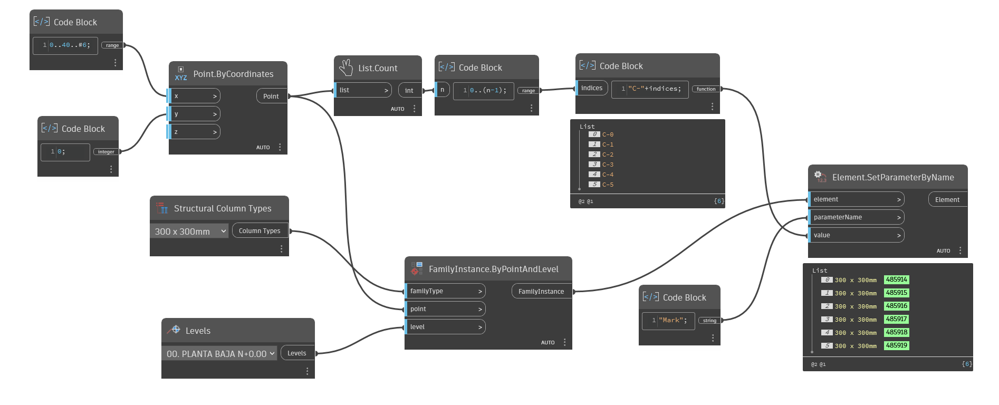

1. **Generar las coordenadas de la fila.** Con un `Code Block`, define un solo rango a lo largo de X:
   ```
   0..40..#6;   // 6 valores de X, de 0 a 40
   ```

2. **Generar el valor fijo para Y y Z.** Con otro `Code Block`:
   ```
   0;
   ```
   Esta misma salida se conecta tanto a `y` como a `z` de `Point.ByCoordinates` — un puerto de salida admite varias conexiones sin problema.

3. **Crear los puntos.** Conecta el rango del paso 1 a `x`, y la salida del paso 2 a `y` y `z`, en un nodo `Point.ByCoordinates`. El resultado es una lista plana de 6 puntos — no hay listas anidadas ni hace falta `Flatten`, porque no se combinaron dos rangos con producto cartesiano.

4. **Contar los puntos.** Conecta la salida `Point` a un nodo `List.Count`. Esto da `n = 6`, el número total de columnas a crear.

5. **Generar los índices.** Con un `Code Block`, crea una secuencia de índices del mismo tamaño que la lista de puntos:
   ```
   n = ?;                // conectar aquí la salida de List.Count
   indices = 0..(n-1);   // 0,1,2,3,4,5 si n=6
   ```
   Al depender de `n`, si más adelante cambias el rango del paso 1, la cantidad de índices se ajusta sola.

6. **Construir los nombres.** Con otro `Code Block`, arma el texto de la marca a partir de los índices (en DesignScript, `+` entre texto y número concatena convirtiendo el número a texto automáticamente):
   ```
   "C-" + (indices + 1);   // "C-1", "C-2", "C-3"...
   ```
   El `+1` es solo para que la numeración empiece en 1 en vez de 0. Si se omite, la lista sale como `C-0, C-1, C-2...` — válido también, es solo cuestión de preferencia.

7. **Definir el tipo de columna.** Usa el nodo `Structural Column Types` y selecciona en el desplegable el tipo de familia ya cargado en el proyecto (por ejemplo, `300 x 300mm`).

8. **Definir el nivel.** Usa el nodo `Levels` y selecciona en el desplegable el nivel base (por ejemplo, `00. PLANTA BAJA N+0.00`).

9. **Colocar las columnas.** Conecta en `FamilyInstance.ByPointAndLevel`:
   - `familyType` ← salida de `Structural Column Types`
   - `point` ← lista de 6 puntos del paso 3
   - `level` ← salida de `Levels`

   La salida `FamilyInstance` es una lista de 6 elementos, en el mismo orden en que se crearon los puntos.

10. **Asignar el nombre a cada columna.** Conecta en `Element.SetParameterByName`:
    - `element` ← salida `FamilyInstance` del paso 9
    - `parameterName` ← un `Code Block` nuevo con `"Mark";`
    - `value` ← lista de `nombres` del paso 6

    Como las tres listas involucradas (`Point`, `FamilyInstance` y `nombres`) tienen 6 elementos y están en el mismo orden en que se generaron, Dynamo las empareja automáticamente elemento por elemento — no hace falta ningún nodo de encaje (lacing).

11. **Verificar el resultado.** Ejecuta el gráfico y revisa en Revit el parámetro `Mark` de cualquier columna — debería coincidir con su posición en la fila (la primera columna por la izquierda es `C-1`, la siguiente `C-2`, y así sucesivamente).


## 9. Solución de problemas

| Problema | Causa probable | Solución |
|---|---|---|
| `List.Count` devuelve 1 en vez del número de elementos esperado | Se está aplicando sobre una lista de listas; Dynamo cuenta la lista principal como un solo objeto de nivel superior | Usa `List.Map` con `List.Count` como función, o activa `List@Level` en el nodo para bajar al nivel correcto |
| Al conectar dos listas de distinto tamaño el resultado tiene menos elementos de los esperados | El encaje del nodo está en "Más corto" (comportamiento por defecto) | Cambia el encaje a "Más largo" o "Producto cartesiano" según el resultado que necesites (ver [sección 4](#4-encaje-de-listas-lacing)) |
| El gráfico se vuelve extremadamente lento al usar producto cartesiano | Dos listas grandes generan una cantidad combinatoria de resultados | Reduce el tamaño de las listas de entrada, o aplica `List.Chop`/filtra antes de generar geometría pesada sobre la rejilla completa |
| `List.FilterByBooleanMask` da un error de tamaños distintos | La lista de datos y la lista de máscara no tienen el mismo número de elementos | Verifica que ambas listas provienen del mismo nivel de la jerarquía y tienen el mismo `List.Count` antes de conectarlas |
| Después de `Flatten`, la geometría generada ya no respeta las agrupaciones originales (por ejemplo, una PolyCurve en zigzag en vez de varias curvas separadas) | `Flatten` elimina toda la información de agrupación de la estructura de datos | Usa `List.Flatten` con un número de niveles específico en vez de `Flatten` completo, o evita aplanar si necesitas conservar la jerarquía |
| `List.Transpose` no reordena como se esperaba en una lista de tres niveles | La transposición solo actúa sobre el nivel superior de la jerarquía | Combina `List.Transpose` con `List.Map` para aplicar la transposición un nivel más abajo, o usa `List.Combine` |
| `List.Combine` da resultados incorrectos o desalineados | Alguna entrada del nodo "combinador" tiene un valor por defecto activo, o el orden de conexión no coincide con el orden de las entradas vacías | Desactiva "Utilizar valor por defecto" en las entradas del combinador y conecta las listas en el mismo orden en que aparecen las entradas vacías |

## 10. Próximos pasos

- Practica el flujo de encaje (más corto, más largo, producto cartesiano) generando una rejilla simple de puntos y observando cómo cambia la geometría resultante al alternar entre los tres modos.
- Repite el ejercicio de `List.Map` vs. `List@Level` sobre la misma estructura de datos hasta que la equivalencia entre ambos métodos sea intuitiva.
- Aplica el ejemplo de la [sección 8](#8-ejemplo-de-aplicación-rejilla-de-columnas-estructurales-con-una-zona-vacía) a un caso real de tu proyecto: sustituye la condición de distancia por otra (por ejemplo, evitar una zona definida por un polígono con `Geometry.DoesIntersect`).
- Explora listas de **n dimensiones** combinando `List.Transpose`, `List.Combine` y `List.Map` sobre geometría importada (superficies NURBS, por ejemplo) para construir estructuras con nervios en dos direcciones.
- Revisa nodos de paquetes de la comunidad como *Clockwork*, *Rhythm* o *Data-Shapes* en el *Package Manager*: muchos resuelven en un solo nodo operaciones de lista que aquí requieren varios pasos.
