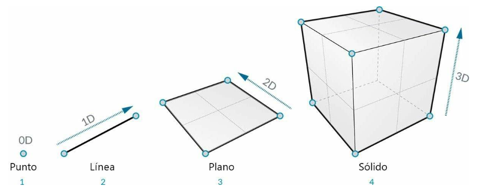
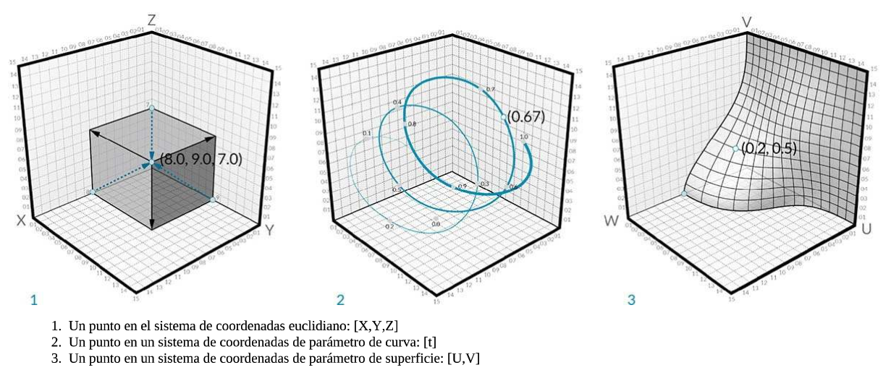
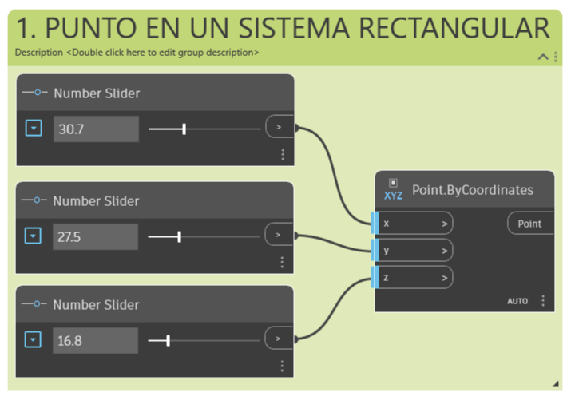
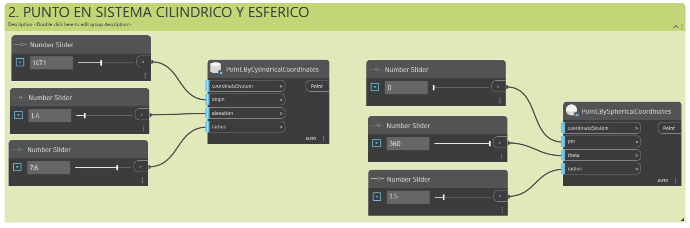
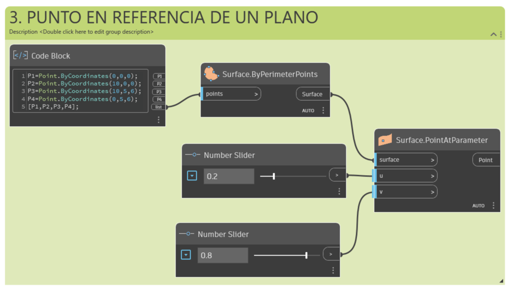
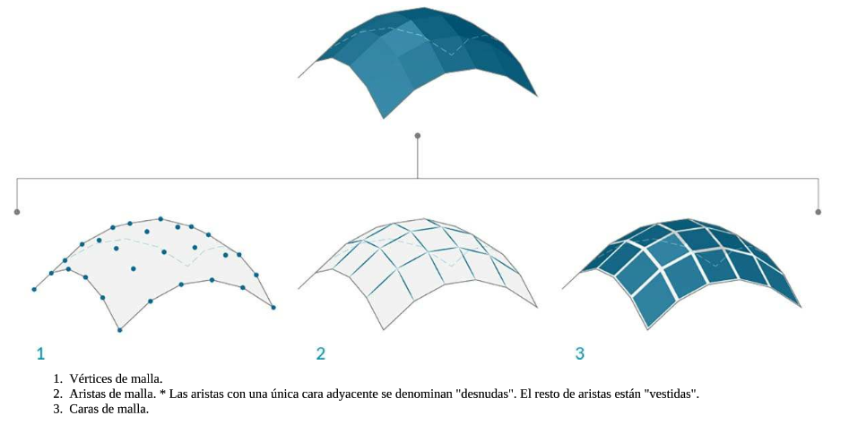

# Guía: Fundamentos de geometría en Dynamo para Revit

## Tabla de contenidos

- [Guía: Fundamentos de geometría en Dynamo para Revit](#guía-fundamentos-de-geometría-en-dynamo-para-revit)
  - [Tabla de contenidos](#tabla-de-contenidos)
  - [1. Introducción](#1-introducción)
  - [2. Conceptos fundamentales](#2-conceptos-fundamentales)
    - [2.1 ¿Qué es la geometría en Dynamo?](#21-qué-es-la-geometría-en-dynamo)
    - [2.2 Jerarquía por dimensionalidad](#22-jerarquía-por-dimensionalidad)
    - [2.3 Tipos abstractos frente a tipos de geometría](#23-tipos-abstractos-frente-a-tipos-de-geometría)
  - [3. Puntos](#3-puntos)
    - [3.1 ¿Qué es un punto?](#31-qué-es-un-punto)
    - [3.2 Sistemas de coordenadas de un punto](#32-sistemas-de-coordenadas-de-un-punto)
    - [3.3 Crear puntos en distintos sistemas](#33-crear-puntos-en-distintos-sistemas)
  - [4. Curvas](#4-curvas)
    - [4.1 ¿Qué es una curva?](#41-qué-es-una-curva)
    - [4.2 Líneas y polilíneas](#42-líneas-y-polilíneas)
    - [4.3 Arcos, círculos y elipses](#43-arcos-círculos-y-elipses)
    - [4.4 NURBS y PolyCurves](#44-nurbs-y-polycurves)
    - [4.5 Crear una curva NURBS paso a paso](#45-crear-una-curva-nurbs-paso-a-paso)
  - [5. Superficies](#5-superficies)
    - [5.1 ¿Qué es una superficie?](#51-qué-es-una-superficie)
    - [5.2 Dominio, isocurvas y coordenadas UV](#52-dominio-isocurvas-y-coordenadas-uv)
    - [5.3 Superficies NURBS y PolySurfaces](#53-superficies-nurbs-y-polysurfaces)
    - [5.4 Consultar una superficie paso a paso](#54-consultar-una-superficie-paso-a-paso)
  - [6. Sólidos](#6-sólidos)
    - [6.1 ¿Qué es un sólido?](#61-qué-es-un-sólido)
    - [6.2 Topología: vértices, aristas y caras](#62-topología-vértices-aristas-y-caras)
    - [6.3 Empalmes y chaflanes](#63-empalmes-y-chaflanes)
    - [6.4 Operaciones booleanas](#64-operaciones-booleanas)
    - [6.5 Bloqueo de nodos para agilizar el trabajo](#65-bloqueo-de-nodos-para-agilizar-el-trabajo)
  - [7. Mallas](#7-mallas)
    - [7.1 ¿Qué es una malla?](#71-qué-es-una-malla)
    - [7.2 Vértices, aristas y caras de malla](#72-vértices-aristas-y-caras-de-malla)
    - [7.3 Mallas frente a superficies NURBS](#73-mallas-frente-a-superficies-nurbs)
  - [8. Aplicaciones prácticas en Revit](#8-aplicaciones-prácticas-en-revit)
  - [9. Ejemplo de aplicación: cubierta perforada paramétrica exportada a Revit](#9-ejemplo-de-aplicación-cubierta-perforada-paramétrica-exportada-a-revit)
  - [10. Solución de problemas](#10-solución-de-problemas)
  - [11. Próximos pasos](#11-próximos-pasos)

## 1. Introducción

Esta guía recorre los fundamentos de la geometría en Dynamo: cómo se organiza jerárquicamente (puntos → curvas → superficies → sólidos), qué tipos de datos abstractos la acompañan, y cómo cada categoría se traduce en nodos concretos. Al terminarla vas a entender por qué un punto no tiene dimensión, por qué un vector no es lo mismo que un punto, cómo se define una superficie mediante U y V, qué hace que un sólido sea "hermético", y cuándo conviene usar mallas en vez de NURBS — todo aplicado a flujos de trabajo reales en Revit.

**Prerrequisitos:**

- Dynamo 2.x instalado (incluido con Revit 2020 en adelante, o como Dynamo Sandbox independiente).
- Conocimientos básicos de la interfaz de Dynamo: crear nodos, conectar cables, usar *Code Block*.
- Se recomienda haber revisado antes los conceptos de **vectores, planos y sistemas de coordenadas**, y de **listas**, ya que ambos se usan como ejemplos a lo largo de esta guía.

> **Nota:** todos los ejemplos funcionan igual en Dynamo Sandbox y en Dynamo for Revit. La [sección 8](#8-aplicaciones-prácticas-en-revit) cubre las particularidades de Revit.

## 2. Conceptos fundamentales

### 2.1 ¿Qué es la geometría en Dynamo?

La **geometría** es el idioma del diseño. Cuando un entorno de programación tiene un núcleo de geometría, se abren las puertas a modelos precisos, a la automatización de rutinas de diseño y a la generación de iteraciones mediante algoritmos.

Tradicionalmente, la geometría se define como el estudio de la forma, el tamaño y la posición relativa de las figuras y las propiedades del espacio. Para trabajar con ella en un entorno computacional como Dynamo conviene tener presentes cuatro principios:

1. La geometría se compone de **datos**: para el ordenador, un conjunto de puntos no se diferencia mucho de una lista de números.
2. La geometría se basa en la **abstracción**: los elementos geométricos se describen mediante números, relaciones y fórmulas dentro de un sistema de coordenadas espacial específico.
3. La geometría tiene una **jerarquía**: los puntos se combinan para crear líneas, las líneas se unen para crear superficies, y así sucesivamente.
4. La geometría describe simultáneamente **la parte y el todo**: una curva es, a la vez, su forma completa y todos los puntos posibles a lo largo de ella.

Estos cuatro principios explican por qué, en la práctica, siempre conviene tener claro con qué tipo de geometría se está trabajando (cómo se creó, qué la compone) para poder descomponerla y recomponerla con fluidez a medida que los modelos se vuelven más complejos.

### 2.2 Jerarquía por dimensionalidad

Una forma sencilla de organizar la geometría es por el número de dimensiones necesarias para describirla:

| Dimensión | Elemento | Descripción |
|---|---|---|
| 0D | **Punto** | Definido por coordenadas; no tiene ninguna dimensión asociada, son solo números que describen cada coordenada. |
| 1D | **Línea** | Definida por dos puntos; tiene una dimensión — se puede "recorrer" hacia delante (dirección positiva) o hacia atrás (dirección negativa). |
| 2D | **Plano** | Definido por dos líneas; tiene dos dimensiones — es posible desplazarse más a la izquierda o más a la derecha, además de hacia delante o hacia atrás. |
| 3D | **Sólido** (cubo) | Definido por dos planos; tiene tres dimensiones — se puede definir una posición también hacia arriba o hacia abajo. |



La dimensionalidad es un método práctico para empezar a organizar la geometría en categorías, pero no es necesariamente el mejor: no todo se modela solo con puntos, líneas, planos y cubos. Existen elementos curvos y toda una categoría adicional de tipos totalmente abstractos —como los vectores— que no se pueden "agarrar" en el espacio de la misma forma que un punto o una línea.

### 2.3 Tipos abstractos frente a tipos de geometría

Una categorización más completa de la jerarquía geométrica distingue entre **tipos abstractos** (o "ayudas", que definen ubicación, orientación, volumen o relaciones, pero no son elementos del modelo) y **tipos de geometría** propiamente dichos (los elementos que sí forman parte del modelo):

| Categoría | Función | Ejemplos |
|---|---|---|
| **Vector** *(abstracto)* | Define la ubicación y la orientación. | Vector, Plano, Sistema de coordenadas |
| **Cuadro delimitador** *(abstracto)* | Define la posición y el volumen aproximado. | Bounding Box |
| **Topología** *(abstracto)* | Define relaciones entre elementos. | Vértices, Bordes, Caras |
| **Punto** | Elemento de modelo. | Coordenada XYZ, Coordenada UV |
| **Curva** | Elemento de modelo. | Línea, Polígono, Arco, Círculo, Elipse, Curva NURBS, PolyCurve |
| **Superficie** | Elemento de modelo. | Superficie NURBS, PolySurface |
| **Sólido** | Elemento de modelo. | Ortoedro, Esfera, Cono, Cilindro |
| **Malla** | Elemento de modelo. | Malla |

En la biblioteca de Dynamo, la categoría **Geometry** organiza los nodos siguiendo una lógica muy similar a esta tabla: `Abstract` (Bounding Box, CoordinateSystem, Vector), `Points`, `Curves`, `Surfaces`, `Solids`, `Meshes` y `Topology`. Dentro de cada subcategoría, los nodos se ordenan alfabéticamente en vez de jerárquicamente, así que conocer esta tabla ayuda a ubicarte más rápido cuando buscas un nodo por primera vez.

> **Nota:** en la vista preliminar en segundo plano de Dynamo, el gráfico o los nodos seleccionados resaltan la geometría correspondiente en color; esto es útil para identificar visualmente qué parte del modelo genera cada nodo, sobre todo en gráficos grandes.

## 3. Puntos

### 3.1 ¿Qué es un punto?

Si la geometría es el idioma de un modelo, los puntos son el alfabeto. Son la base sobre la que se crea el resto de la geometría: se necesitan al menos dos puntos para crear una curva, tres puntos para crear un polígono o una cara de malla, etc.

Un punto se define por uno o más valores denominados **coordenadas**. El número de valores necesarios depende del sistema de coordenadas o del contexto en el que se encuentra. El tipo de punto más común en Dynamo pertenece al sistema de coordenadas universal tridimensional y tiene tres coordenadas `[X, Y, Z]`.

### 3.2 Sistemas de coordenadas de un punto

Los puntos también pueden existir en sistemas de coordenadas distintos del euclidiano tridimensional estándar. La notación de letras cambia según el contexto:

| Contexto | Notación | Significado |
|---|---|---|
| Espacio euclidiano | `[X, Y, Z]` | Coordenadas universales tridimensionales. |
| Parámetro de curva | `[t]` | Posición a lo largo de una curva, normalizada entre 0.0 (inicio) y 1.0 (final). |
| Parámetro de superficie | `[U, V]` | Posición dentro del dominio bidimensional de una superficie. |



Aunque parezca contradictorio, los parámetros de curvas y superficies son continuos y se extienden más allá de la "arista" de la geometría especificada. Como las formas que definen el espacio paramétrico se encuentran, en el fondo, sobre un sistema de coordenadas universal tridimensional, siempre se puede convertir una coordenada paramétrica en una coordenada universal — por ejemplo, el punto `[0.2, 0.5]` de una superficie corresponde a un punto real `[1.8, 2.0, 4.1]` en coordenadas universales.

### 3.3 Crear puntos en distintos sistemas

1. **Coordenadas cartesianas globales** — el caso más simple, con `Point.ByCoordinates(x, y, z)`.



2. **Coordenadas relativas a un sistema local** — usa `CoordinateSystem.ByCylindricalCoordinates` (o esférico) . Esto te permite ubicar un punto por radio, ángulo (`theta`) y altura, en vez de por X/Y/Z directos.




3. **Coordenadas UV sobre una superficie** — usa `Surface.PointAtParameter(surface, u, v)`, que devuelve el punto real en el espacio a partir de una coordenada paramétrica de la superficie.


> **⚠️ Advertencia:** un punto UV sobre una superficie y un punto XYZ universal no son intercambiables directamente — si necesitas la posición real en el espacio de un punto definido en UV, conviértelo primero con `Surface.PointAtParameter`.



## 4. Curvas

### 4.1 ¿Qué es una curva?

El término **curva** es la categoría principal para todo tipo de forma "alargada", incluso aunque tenga un aspecto recto. Desde una perspectiva técnica, una curva describe cada punto posible que se puede encontrar introduciendo un parámetro `t` en un conjunto de funciones — desde algo tan sencillo como `x = -1.26·t, y = t` hasta funciones que implican cálculo diferencial.

Independientemente del tipo de curva, el parámetro `t` se puede evaluar en cualquier punto de su dominio, y toda curva tiene un **punto inicial** y un **punto final**, que se alinean con los valores mínimo y máximo de `t` usados para crearla. En Dynamo, el dominio de `t` de una curva se entiende siempre como de **0.0 a 1.0**.

Toda curva tiene además propiedades que la describen:

- **Cerrada**: cuando la distancia entre el punto inicial y el final es cero.
- **Plana**: cuando todos los puntos de control de la curva se encuentran en el mismo plano.
- **Global vs. local**: la planaridad es una propiedad global de toda la curva, mientras que un vector tangente en un valor de `t` específico es una propiedad local.

### 4.2 Líneas y polilíneas

Las **líneas** son la forma más sencilla de curva — no parecen curvadas, pero matemáticamente sí lo son, solo que sin curvatura. La forma más intuitiva de crearlas es de un punto A a un punto B con `Line.ByStartPointEndPoint`; el segmento se dibuja entre los dos puntos, pero matemáticamente la línea se extiende infinitamente en ambas direcciones.

Cuando conectas varias líneas entre sí, obtienes una **polilínea**, que es la representación directa de lo que es un **punto de control**: editar cualquiera de esas ubicaciones de punto cambia la forma de la polilínea. Si la polilínea está cerrada, se convierte en un **polígono**; si además todas sus aristas tienen la misma longitud, se describe como **regular**.

### 4.3 Arcos, círculos y elipses

Al añadir un poco más de complejidad a las funciones paramétricas, se pueden crear:

- **Arco**: un segmento curvo definido por uno o dos radios y sin cerrarse por completo.
- **Círculo**: la versión cerrada del arco, con un único radio.
- **Arco elíptico**: como el arco, pero con dos radios distintos (mayor y menor).
- **Elipse**: la versión cerrada del arco elíptico.

La diferencia entre la versión "arco" y su equivalente cerrado siempre está en si la forma se cierra o no sobre sí misma.

### 4.4 NURBS y PolyCurves

Las **NURBS** (*Non-Uniform Rational B-Splines*) son representaciones matemáticas capaces de modelar con precisión cualquier forma: desde líneas, círculos, arcos o rectángulos bidimensionales sencillos hasta la curva orgánica tridimensional de forma libre más compleja. Gracias a su flexibilidad y precisión, los modelos NURBS se usan en cualquier proceso, desde la ilustración y la animación hasta la fabricación digital.

Una curva NURBS se define mediante tres propiedades:

- **Grado**: determina el rango de influencia que los puntos de control tienen sobre la curva. Es un número entero positivo (habitualmente 1, 2, 3 o 5, aunque puede ser cualquier entero positivo). Cuanto mayor el grado, mayor el rango de influencia y más puntos de control se usan para interpolar el resultado. Las líneas y polilíneas NURBS suelen ser de grado 1; la mayoría de curvas de forma libre son de grado 3 o 5.
- **Puntos de control**: una lista de puntos de al menos `grado + 1` elementos. Desplazar un punto de control es una de las formas más directas de modificar la forma de una curva NURBS.
- **Grosor**: un número asociado a cada punto de control (normalmente positivo). Cuando todos los puntos de control comparten el mismo grosor (típicamente 1), la curva se denomina **no racional**; de lo contrario, es **racional**. La mayoría de curvas NURBS son no racionales.
- **Nudos**: una lista de `grado + N - 1` números (siendo N el número de puntos de control), que se usan junto con los grosores para controlar la influencia de cada punto de control en la curva resultante — por ejemplo, para crear puntos de torsión en lugares específicos.

Una **PolyCurve** es una curva compuesta por varias curvas conectadas por sus extremos (líneas, arcos, NURBS...) que se comporta como una sola curva a efectos de consulta y manipulación.

### 4.5 Crear una curva NURBS paso a paso

Hay dos nodos principales para crear curvas NURBS a partir de una lista de puntos, y se comportan de forma distinta:

1. **`NurbsCurve.ByControlPoints`** — usa la lista de puntos directamente como **puntos de control**. La curva no pasa necesariamente por cada punto; se ve "atraída" hacia ellos, de forma similar a una polilínea suavizada.
2. **`NurbsCurve.ByPoints`** — dibuja la curva **a través** de cada punto de la lista, interpolando entre ellos. Este nodo acepta además una entrada `degree` opcional para controlar el grado de la interpolación.

```
// Generar puntos de una curva de seno con un Code Block:
nPeriods = 0..nPeriods..#nPts;
nPts = 0..(Math.PI*nPeriods)..#nPts;
```

1. Conecta el resultado a `Point.ByCoordinates` para generar la lista de puntos.
2. Conecta esa lista tanto a `NurbsCurve.ByControlPoints` como a `NurbsCurve.ByPoints` para comparar ambos resultados en la vista preliminar: la primera pasará "cerca" de los puntos, la segunda pasará exactamente sobre ellos.

> **Nota:** si necesitas que la geometría final coincida exactamente con puntos de referencia del proyecto (ejes de columnas, vértices de una topografía), usa `NurbsCurve.ByPoints`. Si buscas una forma suave y editable mediante puntos de control clásicos (como en un software de modelado de superficies), usa `NurbsCurve.ByControlPoints`.

## 5. Superficies

### 5.1 ¿Qué es una superficie?

Una **superficie** es una forma matemática definida por una función y dos parámetros — en lugar de `t` (como en las curvas), se usan **U** y **V** para describir el espacio paramétrico correspondiente. Esto implica más información geométrica disponible: las curvas tienen vectores y planos normales que pueden rotar a lo largo de su longitud, mientras que las superficies tienen vectores normales y planos tangentes coherentes con su orientación en cada punto.

### 5.2 Dominio, isocurvas y coordenadas UV

- **Dominio de superficie**: el rango de parámetros `(U, V)` que se evalúan para obtener un punto tridimensional de la superficie. En Dynamo, el dominio de una superficie se entiende, por defecto, como de **0.0 a 1.0** tanto en U como en V (las superficies planas o recortadas pueden tener dominios distintos).
- **Isocurva** (o curva isoparamétrica): la curva definida por un valor de U o V constante, recorriendo el dominio completo de la otra dirección.
- **Coordenada UV**: el punto del espacio de parámetro UV, definido por `U`, `V` (y, en algunos contextos, `W`).
- **Plano perpendicular**: el plano perpendicular a las isocurvas U y V en una coordenada UV específica.
- **Vector normal**: el vector que define la dirección de "arriba" en relación con ese plano perpendicular.

Aunque la forma de la superficie no parezca "rectangular" y las isocurvas puedan verse más juntas o más separadas en distintas zonas, el espacio definido por el dominio siempre es bidimensional y —salvo excepciones— acotado entre 0.0 y 1.0 en ambas direcciones.

### 5.3 Superficies NURBS y PolySurfaces

Las **superficies NURBS** son muy similares a las curvas NURBS, pero extendidas a dos direcciones: se pueden considerar como una rejilla de curvas NURBS que van tanto en U como en V. Su forma se define mediante el número de puntos de control y el grado en ambas direcciones, usando los mismos algoritmos que las curvas para calcular forma, normales, tangentes y curvaturas.

Las **PolySurfaces** se componen de varias superficies unidas a lo largo de una arista compartida. A diferencia de una única superficie NURBS (con un solo dominio UV), una PolySurface ofrece más de una definición UV bidimensional — una por cada superficie que la compone — por lo que puedes desplazarte por las distintas piezas a través de su **topología**. En ocasiones se les llama "parches"; este modo de unión permite crear formas más complejas y aplicar operaciones de empalme o chaflán a lo largo de las uniones.

> **⚠️ Advertencia:** unir dos superficies NURBS genera una PolySurface, no una única superficie NURBS "fusionada". Las distintas secciones de la geometría conservarán definiciones UV y curvas independientes, así que cualquier consulta por parámetro (`Surface.PointAtParameter`, por ejemplo) debe apuntar a la superficie correcta dentro de la PolySurface.

### 5.4 Consultar una superficie paso a paso

Estos son los nodos más habituales para extraer información de una superficie ya creada o importada:

| Nodo | Qué devuelve |
|---|---|
| `Surface.PointAtParameter` | El punto en el espacio correspondiente a una coordenada UV. |
| `Surface.NormalAtParameter` | El vector normal en una coordenada UV. |
| `Surface.GetIsoline` | La curva isoparamétrica en una dirección (U o V) para un valor constante. |

```
Superficie ──> surface ─┐
u          ──> u        ├──> Surface.PointAtParameter ──> Point
v          ──> v        ┘

Superficie ──> surface ─┐
u          ──> u        ├──> Surface.NormalAtParameter ──> Vector
v          ──> v        ┘
```

Combinar `Surface.PointAtParameter` con `Surface.NormalAtParameter` sobre una rejilla de valores U/V (usando el encaje de producto cartesiano — ver la guía de listas) es la base de casi cualquier flujo de trabajo de paneles, perforaciones o mobiliario distribuido sobre una superficie curva, como se muestra en el [ejemplo de aplicación](#9-ejemplo-de-aplicación-cubierta-perforada-paramétrica-exportada-a-revit) al final de esta guía.

## 6. Sólidos

### 6.1 ¿Qué es un sólido?

Cuando se necesitan modelos más complejos que no se puedan crear a partir de una única superficie, o cuando se necesita definir un volumen explícito, hace falta trabajar con **sólidos** (y PolySurfaces). Incluso un cubo sencillo es lo bastante complejo como para necesitar seis superficies, una por cada cara.

Un sólido consta de una o varias superficies que contienen un volumen a partir de un contorno cerrado que define qué está "dentro" y qué "fuera". Independientemente de cuántas superficies tenga, deben formar un volumen **hermético** para que se considere un sólido. Los sólidos se pueden crear mediante la unión de superficies o PolySurfaces, o mediante operaciones como solevación, barrido o revolución. Las primitivas de esfera, cubo, cono y cilindro también son sólidos por definición.

> **Nota:** un cubo al que le falta al menos una cara se considera una PolySurface — comparte algunas propiedades con un sólido, pero **no lo es**, porque su volumen no está cerrado herméticamente.

### 6.2 Topología: vértices, aristas y caras

Los sólidos se componen de tres tipos de elementos, agrupados bajo el nombre de **topología**:

- **Caras**: las superficies que conforman el sólido.
- **Aristas**: las curvas que definen la conexión entre caras adyacentes.
- **Vértices**: los puntos inicial y final de esas aristas.

Estos elementos se pueden consultar mediante los nodos de la categoría `Topology` de Dynamo (`Topology.Faces`, `Topology.Edges`, `Topology.Vertices`), lo cual es especialmente útil cuando necesitas aplicar una operación a solo una parte del sólido — por ejemplo, empalmar únicamente las aristas superiores de un volumen.

### 6.3 Empalmes y chaflanes

Los sólidos se pueden modificar suavizando sus esquinas y ángulos agudos:

- **Chaflán** (`Solid.Chamfer`): crea una superficie reglada (plana) entre dos caras, generando una arista biselada.
- **Empalme** (`Solid.Fillet`): fusiona las caras adyacentes manteniendo la tangencia, generando una transición curva y suave.

### 6.4 Operaciones booleanas

Las **operaciones booleanas** de sólidos son métodos para combinar dos o más sólidos. Una única operación booleana implica, en realidad, cuatro pasos internos: intersecar los objetos, dividirlos en las intersecciones, suprimir las partes no deseadas de la geometría, y volver a unir todo lo que queda. Gracias a esto, las operaciones booleanas ahorran mucho trabajo manual de recorte y unión.

Existen tres operaciones booleanas principales, que se diferencian en qué parte de la geometría se conserva:

| Operación | Qué conserva |
|---|---|
| **Unión** (`Solid.Union`) | Elimina las partes que se solapan entre los sólidos y los une en un único sólido. |
| **Diferencia** (`Solid.Difference`) | Resta un sólido de otro. El sólido que se resta se conoce como "herramienta"; invertir cuál es la herramienta cambia el volumen resultante. |


Además de estas tres, Dynamo incluye `Solid.UnionAll` y `Solid.DifferenceAll` para realizar la operación correspondiente entre **varios** sólidos a la vez, en vez de tener que encadenar operaciones de dos en dos.

### 6.5 Bloqueo de nodos para agilizar el trabajo

Las operaciones booleanas son computacionalmente costosas y pueden volver un gráfico lento si se recalculan constantemente mientras ajustas otros valores. Dynamo ofrece la función **Bloquear** (clic derecho sobre un nodo → *Bloquear*) para suspender la ejecución de un nodo seleccionado y de todos los nodos que dependen de él.

- El nodo bloqueado y sus descendientes se muestran atenuados en gris claro, y los cables afectados se dibujan como líneas continuas discontinuas.
- Mientras está bloqueado, puedes cambiar libremente los valores "aguas arriba" (por ejemplo, el radio de los conos que vas a unir a una esfera) sin que Dynamo recalcule la operación booleana en cada cambio.
- Para reanudar el cálculo, desactiva **Bloquear** de nuevo en el mismo menú contextual; todos los nodos afectados se actualizan y la vista preliminar vuelve al modo estándar.

> **Nota:** este flujo de bloqueo/desbloqueo es especialmente valioso al iterar sobre geometría con muchas operaciones booleanas encadenadas (como perforaciones repetidas sobre una superficie), donde cada recálculo puede tardar varios segundos.

## 7. Mallas

### 7.1 ¿Qué es una malla?

En el modelado computacional, las **mallas** son una de las formas más generalizadas de representar geometría 3D. Pueden ser una alternativa más ligera y flexible al uso de NURBS, y se emplean en prácticamente todo: renderización, visualización, fabricación digital e impresión 3D.

Una malla es un conjunto de cuadriláteros y triángulos que representa una superficie o un sólido. Al igual que los sólidos, la estructura de un objeto de malla incluye vértices, aristas y caras, además de propiedades adicionales propias de las mallas, como las **normales de vértice**.

### 7.2 Vértices, aristas y caras de malla

Dynamo define las mallas mediante una estructura de datos de **cara-vértice**: en su nivel más básico, es un conjunto de puntos (los **vértices**) agrupados en polígonos (las **caras**) mediante un **grupo de índice**.



Para crear una malla con `Mesh.ByPointsFaceIndices` necesitas:

1. Una lista de puntos (los vértices de la malla).
2. Una lista de grupos de índice (`IndexGroup.ByIndices`) que definen qué vértices forman cada cara, referenciados por su posición en la lista de puntos.

```
p1 = Point.ByCoordinates(3,-2);
p2 = Point.ByCoordinates(1,2);
p3 = Point.ByCoordinates(0,0);
...

A = IndexGroup.ByIndices(0,2,1);
B = IndexGroup.ByIndices(1,2,3);
...

Mesh.ByPointsFaceIndices(vertexPositions={p1,p2,...}, indices={A,B,...});
```

> **Nota:** una cara es una lista **ordenada** de tres o cuatro vértices. Como la representación de la cara se deduce de la posición de esos vértices, se puede reutilizar el mismo vértice en varias caras. El orden de los índices dentro de un grupo puede cambiar, siempre que la secuencia se mantenga en sentido **contrario a las agujas del reloj** para que la cara se defina correctamente.

Para cada vértice también existe una **normal de vértice** (un vector) que describe la dirección media de las caras conectadas a él, y que ayuda a entender la orientación de "entrada" y "salida" de la malla.

### 7.3 Mallas frente a superficies NURBS

| Aspecto | Superficie NURBS | Malla |
|---|---|---|
| **Parametrización** | Definida por curvas en direcciones U y V; permite un dominio de superficie bidimensional continuo y cálculos con precisión arbitrariamente alta. | Formada por un número específico y finito de caras y vértices; no tiene una parametrización UV continua sencilla. |
| **Combinación de piezas** | Unir varias superficies NURBS genera una PolySurface, con distintas definiciones UV por sección. | Las caras son independientes entre sí; la precisión se controla ajustando o añadiendo caras manualmente. |
| **Influencia local vs. global** | Desplazar un único punto de control suele producir un cambio suave y **extenso** en toda la forma (depende del grado, los grosores y los nudos). | Desplazar un vértice solo afecta a las caras **adyacentes** a ese vértice — el cambio es estrictamente local. |
| **Analogía** | Imagen **vectorial**: al ampliar el zoom, las curvas permanecen nítidas. | Imagen **ráster**: al ampliar el zoom, se ven los "píxeles" (caras) individuales con una resolución fija. |

Esta diferencia entre influencia local y global es una de las razones principales para elegir mallas sobre NURBS (o viceversa): si necesitas ediciones puntuales muy localizadas (por ejemplo, esculpir el detalle de una superficie orgánica compleja), las mallas ofrecen más control directo; si necesitas curvas suaves y matemáticamente precisas (por ejemplo, para fabricación CNC), las NURBS son la opción más adecuada.

> **Nota:** las funciones de malla nativas de Dynamo se pueden ampliar con el paquete **Kit de herramientas de malla** (*Mesh Toolkit*), disponible en el *Package Manager*. Añade nodos para importar mallas desde formatos externos (`Mesh.ImportFile`), crear mallas a partir de geometría de Dynamo, y extraer o reparar información de una malla existente (`Mesh.Vertices`, `Mesh.Edges`, `Mesh.Triangles`, entre otros).

Mas informacion visitar la direccion: https://github.com/DynamoDS/Dynamo/wiki/Dynamo-Mesh-Toolkit

## 8. Aplicaciones prácticas en Revit

Estos conceptos dejan de ser abstractos en cuanto se conectan con flujos de trabajo reales de Revit:

- **DirectShape**: los sólidos, superficies y mallas creados en Dynamo se pueden llevar a Revit como elementos `DirectShape.ByGeometry`, útiles para masas conceptuales, geometría de análisis o elementos sin categoría de familia predefinida.
- **Componentes adaptativos**: los puntos y las coordenadas UV de una superficie son la base para posicionar y orientar *Adaptive Components* sobre geometría curva — por ejemplo, un panel de fachada por cada celda de una rejilla UV.
- **Masas conceptuales y análisis de fachada**: dividir una superficie en una rejilla de puntos (con `Surface.PointAtParameter`) y calcular sus normales (`Surface.NormalAtParameter`) es la base de los análisis de sombreado, radiación solar o distribución de paneles en masas conceptuales de Revit.
- **Topología de sólidos importados**: al importar geometría (SAT, IFC) o extraerla de elementos de Revit, los nodos de `Topology` permiten navegar caras, aristas y vértices para aplicar operaciones selectivas — como empalmar solo un subconjunto de aristas.
Nota: SAT es el formato del motor de modelado ACIS — el mismo kernel que usa Revit internamente para sus sólidos. No es un archivo "descargable" de un repositorio típico como sí lo son las familias de Revit; normalmente lo generas tú mismo exportando desde otro software
- **Optimización de mallas para renderizado o impresión 3D**: exportar geometría de Revit a malla (mediante *Mesh Toolkit*) es un paso habitual antes de enviar el modelo a un motor de renderizado externo o a una impresora 3D, donde una representación de malla es más eficiente que la NURBS original.
- **Elección de representación según el uso**: para fabricación digital de precisión (paneles CNC, moldes) conviene mantener la geometría en NURBS/sólidos el mayor tiempo posible; para visualización rápida o edición escultórica de detalle, conviene convertir a malla en una etapa temprana del flujo de trabajo.

## 9. Ejemplo de aplicación: cubierta perforada paramétrica exportada a Revit

Este ejemplo combina puntos, superficies, sólidos y operaciones booleanas en un flujo de trabajo realista: generar una cubierta curva con perforaciones circulares distribuidas paramétricamente, y llevarla a Revit como un elemento `DirectShape`.

1. **Crear la superficie base.** Genera una superficie mediante `Surface.ByPatch` a partir de una curva cerrada (por ejemplo, un rectángulo con las esquinas desplazadas en Z para dar curvatura), o impórtala desde un archivo SAT con `Geometry.ImportFromSAT` si ya tienes la forma modelada en otro software.
2. **Engrosar la superficie en un sólido base.** Conecta la superficie a `Surface.Thicken` con un espesor pequeño (por ejemplo, 15 cm) para obtener el volumen sólido de la cubierta.
3. **Generar la rejilla de perforaciones.** Con un `Code Block`, define dos rangos de parámetros UV:
   ```
   uParam = 0.05..0.95..#20;
   vParam = 0.05..0.95..#12;
   ```
   Conecta ambos a `Surface.PointAtParameter` (con el encaje en producto cartesiano) para obtener una rejilla de puntos sobre la superficie, y a `Surface.NormalAtParameter` para obtener la normal en cada uno de esos puntos.
4. **Construir un cilindro perforador en cada punto.** Para cada punto y su normal correspondiente, usa `Point.Translate` con la normal (y su inverso, `Vector.Reverse`) para calcular un punto de inicio y un punto final ligeramente por encima y por debajo de la superficie, y crea un `Cylinder.ByPointsRadius` (o `Cone.ByPointsRadii` si prefieres perforaciones cónicas) entre ambos puntos, con un radio pequeño (por ejemplo, 8 cm).
5. **Restar las perforaciones del sólido base.** Conecta el sólido de la cubierta y la lista completa de cilindros a `Solid.DifferenceAll`, usando la cubierta como sólido base y los cilindros como "herramienta" a restar. El resultado es la cubierta con todas las perforaciones aplicadas de una sola vez.
   > **Nota:** activa **Bloquear** (ver [sección 6.5](#65-bloqueo-de-nodos-para-agilizar-el-trabajo)) sobre el nodo `Solid.DifferenceAll` mientras ajustas el radio o la densidad de la rejilla, para evitar recalcular la operación booleana en cada cambio de valor.
6. **Suavizar las aristas de las perforaciones (opcional).** Consulta las aristas del sólido resultante con `Topology.Edges` y aplica `Solid.Fillet` con un radio pequeño para redondear el borde de cada perforación.
7. **Exportar el resultado a Revit.** Conecta el sólido final a `DirectShape.ByGeometry`, indicando la categoría de Revit deseada (por ejemplo, "Entourage" o una categoría genérica de masas) y, si tu plantilla lo requiere, el material a aplicar.
8. **Verificar el resultado.** Ejecuta el gráfico y confirma en la vista 3D de Revit que la cubierta aparece con el patrón de perforaciones distribuido uniformemente sobre toda su superficie curva, y que el `DirectShape` se puede seleccionar y consultar como cualquier otro elemento del modelo.

> **⚠️ Advertencia:** cuantas más perforaciones genere la rejilla UV, más lenta será la operación `Solid.DifferenceAll` — empieza con una rejilla pequeña (por ejemplo, 5 × 5) para validar el flujo completo, y solo después aumenta la densidad a su valor final.

## 10. Solución de problemas

| Problema | Causa probable | Solución |
|---|---|---|
| Al unir dos superficies NURBS, los nodos posteriores que consultan por parámetro UV fallan o dan resultados inesperados | La unión genera una PolySurface con varias definiciones UV independientes, no una única superficie continua | Usa `Topology.Faces` para aislar la superficie concreta dentro de la PolySurface antes de consultarla por parámetro |
| Un sólido "cerrado" en apariencia se comporta como una PolySurface (por ejemplo, no acepta operaciones booleanas) | Falta al menos una cara para que el volumen sea hermético | Verifica con `Solid.???` o revisa visualmente si hay huecos; usa `PolySurface.SolidWithBoundary` o vuelve a construir el volumen asegurando que todas las caras estén unidas |
| Las operaciones booleanas tardan mucho o el gráfico se congela al ajustar un slider | Recalcular una operación booleana compleja en cada cambio de valor es costoso | Activa **Bloquear** sobre el nodo de la operación booleana mientras ajustas valores aguas arriba, y desactívalo cuando quieras ver el resultado actualizado |
| Un `Cone.ByPointsRadii` o `Cylinder.ByPointsRadius` aparece apuntando en la dirección opuesta a la esperada | El vector normal usado para calcular el punto final no se invirtió correctamente | Usa `Vector.Reverse` sobre la normal para obtener la dirección "hacia dentro" antes de calcular el punto final con `Point.Translate` |
| Una malla importada se ve con caras volteadas o normales inconsistentes | El orden de los índices en algunas caras no sigue el sentido antihorario esperado, o la malla de origen tiene normales invertidas | Revisa el orden de los `IndexGroup` al construir la malla manualmente, o usa las herramientas de reparación del paquete *Mesh Toolkit* sobre mallas importadas |
| El `DirectShape.ByGeometry` no aparece o Revit lo rechaza | La geometría de entrada no es un sólido válido (por ejemplo, es una PolySurface con huecos) o la categoría elegida no admite el tipo de geometría | Verifica que la geometría sea un sólido hermético antes de exportar, y prueba con una categoría genérica de masas si la categoría original da error |

## 11. Próximos pasos

- Repite el ejercicio de comparar `NurbsCurve.ByControlPoints` frente a `NurbsCurve.ByPoints` sobre la misma lista de puntos, hasta que la diferencia entre "puntos de control" y "curva interpolada" sea intuitiva.
- Practica las tres operaciones booleanas de sólidos (unión, diferencia, intersección) sobre dos esferas superpuestas, y observa cómo invertir qué sólido es la "herramienta" en `Solid.Difference` cambia el resultado.
- Aplica el ejemplo de la [sección 9](#9-ejemplo-de-aplicación-cubierta-perforada-paramétrica-exportada-a-revit) a un caso real de tu proyecto: sustituye la rejilla uniforme de perforaciones por una máscara booleana (ver la guía de listas) que module la densidad según la distancia a un punto de interés.
- Explora el paquete **Mesh Toolkit** para convertir un sólido o una superficie NURBS de tu proyecto a malla, y compara el resultado visual y el peso del archivo frente a la geometría NURBS original.
- Revisa la categoría `Topology` de Dynamo con más detenimiento: `Topology.Faces`, `Topology.Edges` y `Topology.Vertices` son la base de flujos de trabajo avanzados que aplican operaciones selectivas a partes concretas de un sólido o una PolySurface.
