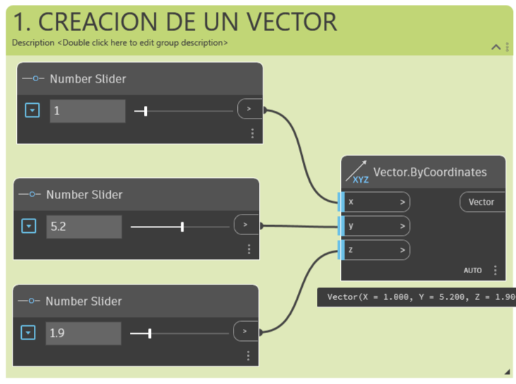
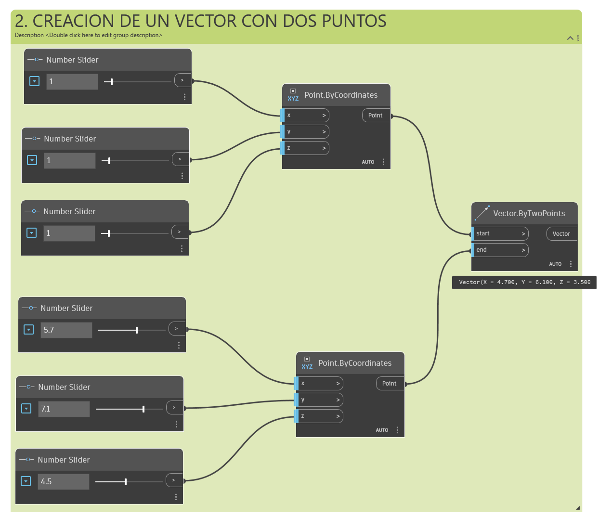
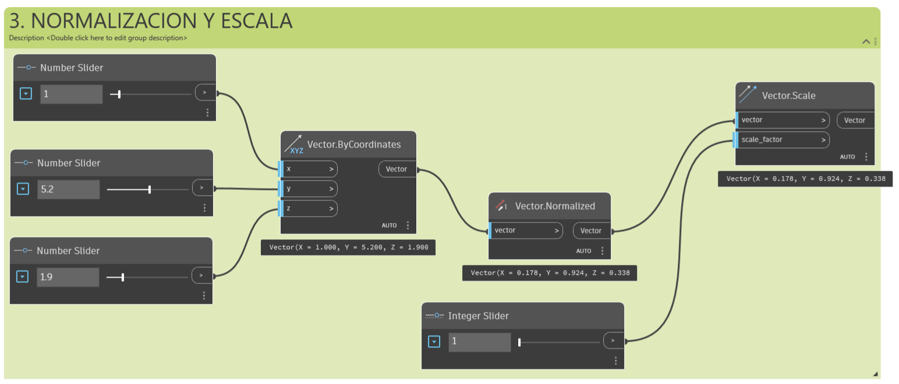
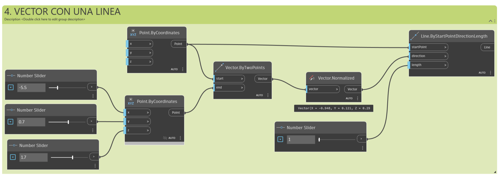
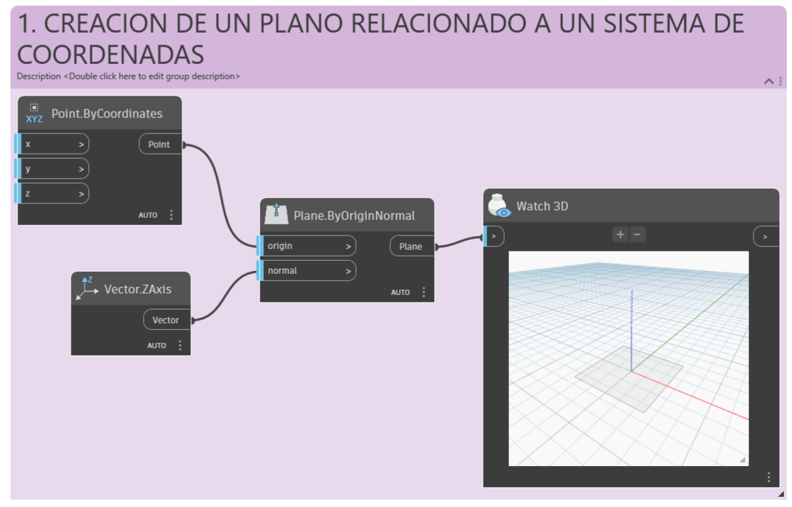
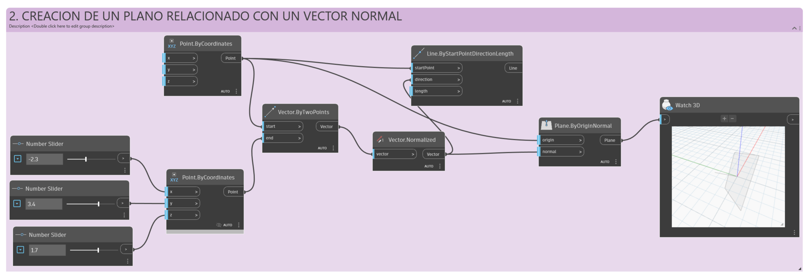

# Guía: Vectores, planos y sistemas de coordenadas en Dynamo para Revit

## Tabla de contenidos

- [1. Introducción](#1-introducción)
- [2. Conceptos fundamentales](#2-conceptos-fundamentales)
  - [2.1 ¿Qué es un vector?](#21-qué-es-un-vector)
  - [2.2 ¿Qué es un plano?](#22-qué-es-un-plano)
  - [2.3 ¿Qué es un sistema de coordenadas?](#23-qué-es-un-sistema-de-coordenadas)
- [3. Proceso: construir vectores, planos y sistemas de coordenadas en Dynamo](#3-proceso-construir-vectores-planos-y-sistemas-de-coordenadas-en-dynamo)
  - [3.1 Crear un vector a partir de coordenadas](#31-crear-un-vector-a-partir-de-coordenadas)
  - [3.2 Crear un vector entre dos puntos (vector AB)](#32-crear-un-vector-entre-dos-puntos-vector-ab)
  - [3.3 Normalizar y escalar un vector](#33-normalizar-y-escalar-un-vector)
  - [3.4 Visualizar un vector con una línea](#34-visualizar-un-vector-con-una-línea)
  - [3.5 Crear un plano](#35-crear-un-plano)
  - [3.6 Crear un sistema de coordenadas](#36-crear-un-sistema-de-coordenadas)
  - [3.7 Verificar que funcionó](#37-verificar-que-funcionó)
- [4. Operaciones vectoriales que todo diseñador computacional debería conocer](#4-operaciones-vectoriales-que-todo-diseñador-computacional-debería-conocer)
- [5. Aplicaciones prácticas en Revit](#5-aplicaciones-prácticas-en-revit)
- [6. Solución de problemas](#6-solución-de-problemas)
- [7. Próximos pasos](#7-próximos-pasos)

## 1. Introducción

Esta guía explica, de forma progresiva, los tres bloques geométricos que sostienen casi todo el diseño computacional en Dynamo: **vectores**, **planos** y **sistemas de coordenadas**. Al terminarla vas a poder crear estos tres elementos desde cero, entender la diferencia entre un punto y un vector, y aplicar ese conocimiento a casos reales dentro de Revit (orientar familias, colocar componentes adaptativos, generar geometría alineada a una fachada, etc.).

**Prerrequisitos:**

- Dynamo 2.x instalado (viene incluido con Revit 2020 en adelante, o como Dynamo Sandbox independiente).
- Conocimientos básicos de la interfaz de Dynamo: crear nodos, conectar cables, usar *Number Sliders*.
- No se necesita experiencia previa en álgebra vectorial; los conceptos se explican desde cero.

> **Nota:** los ejemplos funcionan igual en Dynamo Sandbox y en Dynamo for Revit. Las diferencias específicas de Revit se cubren en la [sección 5](#5-aplicaciones-prácticas-en-revit).

## 2. Conceptos fundamentales

### 2.1 ¿Qué es un vector?

Un **vector** es una cantidad geométrica que describe **dirección** y **magnitud**. A diferencia de un punto, un vector es abstracto: no representa un lugar en el espacio, sino una *diferencia relativa* de posición.

Un punto y un vector se parecen porque ambos se componen de una lista de valores `{x, y, z}`, pero:

- Un **punto** describe una posición específica dentro de un sistema de coordenadas.
- Un **vector** describe una diferencia de posición, es decir, una dirección con una longitud asociada.

Cuando el vector se define entre dos puntos A y B, se le llama **vector AB**, y se calcula restando las coordenadas del punto inicial a las del punto final:

$$\vec{AB} = \{d_x, d_y, d_z\} = \{x_b - x_a,\ y_b - y_a,\ z_b - z_a\}$$

Una forma intuitiva de pensarlo: *"Estoy de pie en el punto A, mirando hacia el punto B"*. Esa dirección, de A hacia B, es el vector.

El vector tiene tres partes:

1. **Base**: el punto inicial del vector.
2. **Punta** (o **sentido**): el punto final del vector.
3. El vector AB **no es igual** al vector BA — este último apunta en la dirección exactamente opuesta.

> **Nota:** en Dynamo, los vectores pertenecen a la categoría abstracta de "ayudas" (*helpers*), igual que los planos. Esto significa que, al crear un vector, no aparecerá nada visible en la vista preliminar del fondo (*background preview*) a menos que lo materialices con geometría real, como una línea (ver [sección 3.4](#34-visualizar-un-vector-con-una-línea)).

### 2.2 ¿Qué es un plano?

Un **plano** es otra "ayuda" abstracta, pero bidimensional. Conceptualmente es una superficie plana que se extiende infinitamente en dos direcciones. Dynamo lo renderiza como un rectángulo pequeño cerca de su origen, solo para que puedas verlo.

Todo plano tiene:

- Un **origen**: el punto donde se ancla el plano en el espacio.
- Una **dirección normal**: el vector perpendicular a la superficie del plano, que define hacia dónde "mira".
- Ejes locales **X** e **Y** que definen su orientación dentro de esa superficie.

Si trabajas con software CAD/BIM ya conoces esta idea, aunque con otro nombre: los planos de construcción o "niveles" (XY, XZ, YZ, o Norte/Sureste/Nivel) son exactamente esto — contextos bidimensionales locales sobre los que se dibuja.

### 2.3 ¿Qué es un sistema de coordenadas?

Un **sistema de coordenadas** (*Coordinate System*) tiene las mismas partes que un plano —origen y direcciones de eje— pero añade el tercer eje (Z) explícitamente y sirve como marco de referencia completo en 3D, no solo una superficie.

Por convención, en la vista preliminar de Dynamo los ejes se colorean así:

| Eje | Color |
|---|---|
| X | Rojo |
| Y | Verde |
| Z | Azul |

Además del sistema cartesiano estándar (XYZ), existen sistemas de coordenadas alternativos como el **cilíndrico** y el **esférico**, útiles cuando la geometría del proyecto se describe mejor en términos de radio y ángulo que de ejes ortogonales (por ejemplo, fachadas curvas, cúpulas o distribución radial de columnas).

## 3. Proceso: construir vectores, planos y sistemas de coordenadas en Dynamo

### 3.1 Crear un vector a partir de coordenadas

El nodo más directo para crear un vector es `Vector.ByCoordinates`, que recibe tres números (x, y, z).

1. Arrastra tres nodos `Number Slider` al lienzo.
2. Crea un nodo `Vector.ByCoordinates`.
3. Conecta cada slider a las entradas `x`, `y`, `z` del nodo.



Este vector representa una dirección desde el origen `{0,0,0}` hacia el punto `{x,y,z}` — pero recuerda que, al ser un vector, en realidad no está anclado a ningún lugar: solo describe una dirección y una magnitud.

### 3.2 Crear un vector entre dos puntos (vector AB)

Cuando lo que tienes son dos puntos reales (por ejemplo, dos esquinas de un muro) y quieres saber la dirección de uno al otro, usa el nodo `Vector.ByTwoPoints`.

1. Crea dos nodos `Point.ByCoordinates`, uno para el punto A y otro para el punto B.
2. Crea un nodo `Vector.ByTwoPoints`.
3. Conecta el punto A a la entrada `startPoint` y el punto B a la entrada `endPoint`.



Internamente, Dynamo hace exactamente el cálculo descrito en la [sección 2.1](#21-qué-es-un-vector): resta las coordenadas de A a las de B.

> **⚠️ Advertencia:** si conectas los puntos al revés (B como inicio y A como final), obtendrás el vector BA, que apunta en dirección opuesta. Esto es una causa común de geometría "invertida" en scripts de orientación.

### 3.3 Normalizar y escalar un vector

Un vector recién creado normalmente tiene una longitud arbitraria (la distancia entre sus coordenadas). Para trabajar con la **dirección pura**, sin importar la magnitud, se **normaliza**: se ajusta su longitud a 1, conservando la dirección.

1. Conecta tu vector a un nodo `Vector.Normalized`.
2. Si necesitas una longitud específica (por ejemplo, 5.5 unidades), usa `Vector.Scale` sobre el vector normalizado, con un `Number Slider` en la entrada `scale_factor`.



> **Nota:** este patrón —normalizar y luego escalar— es el que más vas a repetir en Dynamo. Te permite separar "hacia dónde apunta" de "qué tan lejos llega", y son casi siempre dos decisiones de diseño distintas.

### 3.4 Visualizar un vector con una línea

Como los vectores no se dibujan en la vista preliminar, la forma habitual de "verlos" es convertirlos en una línea real con `Line.ByStartPointDirectionLength`.

1. Crea un `Point.ByCoordinates` para el punto de inicio.
2. Conecta tu vector (normalizado, sin escalar) a la entrada `direction`.
3. Conecta un `Number Slider` a la entrada `length` para controlar el tamaño visible de la línea.



También puedes usar `Point.Add` (punto + vector escalado) para calcular dónde termina el vector si partiera desde un punto específico — útil cuando necesitas el punto final real, no solo la línea de vista previa.

### 3.5 Crear un plano

El nodo `Plane.ByOriginNormal` construye un plano a partir de un punto de origen y un vector que define su dirección normal (perpendicular).

1. Crea un `Point.ByCoordinates` para el origen.
2. Crea un vector con `Vector.ByCoordinates`, normalízalo y —opcionalmente— escálalo (ver [3.3](#33-normalizar-y-escalar-un-vector)).
3. Crea un nodo `Plane.ByOriginNormal` y conecta el punto a `origin` y el vector a `normal`.





Otras formas comunes de crear un plano, útiles según el contexto:

| Nodo | Cuándo usarlo |
|---|---|
| `Plane.ByOriginNormal` | Ya tienes un punto y una dirección clara. |
| `Plane.ByOriginNormalXAxis` | Necesitas además controlar la orientación del eje X del plano (por ejemplo, para alinear una familia). |
| `Plane.ByThreePoints` | Tienes tres puntos no colineales (por ejemplo, tres esquinas de una losa) y quieres el plano que los contiene. |
| `Plane.ByBestFitThroughPoints` | Tienes muchos puntos ligeramente irregulares (una nube de puntos de un escaneo) y necesitas el plano promedio. |

### 3.6 Crear un sistema de coordenadas

El nodo básico es `CoordinateSystem.ByOrigin`, que crea un sistema alineado con los ejes globales, ubicado en el punto que indiques.

1. Crea un `Point.ByCoordinates`.
2. Crea un nodo `CoordinateSystem.ByOrigin` y conecta el punto a la entrada `origin`.

Si necesitas controlar también la orientación (no solo la posición), usa `CoordinateSystem.ByOriginVectors`, que además del origen recibe los vectores de los ejes X e Y.

```
Point.ByCoordinates ──> origin ──> CoordinateSystem.ByOrigin ──> CoordinateSystem
```

En la vista preliminar verás el origen como un punto y tres líneas cortas de color rojo (X), verde (Y) y azul (Z) saliendo de él.

### 3.7 Verificar que funcionó

- Un **vector** correctamente creado no muestra nada en la vista preliminar por sí solo; si conectaste una línea o un `Point.Add` y ves geometría en la dirección esperada, el vector está bien construido.
- Un **plano** se ve como un rectángulo pequeño cerca del origen indicado, con una flecha (la normal) perpendicular a su superficie.
- Un **sistema de coordenadas** se ve como un punto de origen con tres ejes de colores (rojo/verde/azul) saliendo de él.
- Si algo no aparece, revisa primero que ningún nodo tenga una advertencia (triángulo amarillo) o error (círculo rojo) en su esquina.

## 4. Operaciones vectoriales que todo diseñador computacional debería conocer

Más allá de crear y escalar vectores, hay operaciones vectoriales que resuelven problemas de diseño muy frecuentes en Revit y Dynamo:

- **Producto punto** (`Vector.Dot`): mide qué tan alineados están dos vectores. Es la base para calcular el ángulo entre dos direcciones o para saber si una superficie "mira" hacia el sol (análisis de asoleamiento).
- **Producto cruz** (`Vector.Cross`): dados dos vectores, devuelve un tercer vector perpendicular a ambos. Se usa constantemente para calcular la normal de una superficie a partir de dos direcciones conocidas sobre ella.
- **Ángulo entre vectores** (`Vector.AngleBetween` o `Vector.AngleAboutAxis`): calcula el ángulo entre dos direcciones, útil para rotar familias hasta alinearlas con una referencia (un muro, una calle, el norte del proyecto).
- **Vector inverso** (`Vector.Reverse`): invierte el sentido de un vector sin cambiar su magnitud — el equivalente a pasar de AB a BA.
- **Suma y resta de vectores** (`Vector.Add`, `Vector.Subtract`): combinan direcciones, por ejemplo, para desplazar un punto en varias direcciones a la vez (offset diagonal).
- **Vectores unitarios de ejes**: `Vector.XAxis()`, `Vector.YAxis()`, `Vector.ZAxis()` devuelven directamente los vectores `{1,0,0}`, `{0,1,0}` y `{0,0,1}` sin necesidad de escribirlos manualmente.

> **Nota:** en la práctica, el patrón "vector entre dos puntos → normalizar → producto cruz con el eje Z → obtener perpendicular en planta" es uno de los flujos más usados para calcular direcciones de barandas, muros cortina o paneles de fachada perpendiculares a una trayectoria.

## 5. Aplicaciones prácticas en Revit

Estos conceptos dejan de ser abstractos en cuanto se conectan con elementos reales del modelo de Revit:

- **Orientar familias con `FamilyInstance.SetRotation` o parámetros de dirección**: al colocar una familia (por ejemplo, un poste de iluminación o un árbol) a lo largo de un camino, se calcula el vector tangente a la curva en cada punto y se usa ese vector para rotar la instancia, de forma que quede perpendicular u orientada al recorrido.
- **Componentes adaptativos**: los *Adaptive Components* usan planos y sistemas de coordenadas locales en cada punto adaptativo para orientar geometría paramétrica (paneles de fachada, por ejemplo) según la curvatura de la superficie base.
- **Análisis de asoleamiento**: comparar la normal de una fachada (un vector) contra la dirección del sol en cierta hora (otro vector) mediante `Vector.AngleBetween` permite estimar exposición solar sin salir de Dynamo.
- **Niveles y planos de trabajo**: `Level.Plane` y los planos de referencia de Revit se pueden leer y usar como planos de Dynamo para alinear geometría nueva con niveles existentes del proyecto.
- **Sistemas de coordenadas compartidas**: al exportar o coordinar modelos entre disciplinas (estructura, MEP, arquitectura), entender el sistema de coordenadas interno de Revit frente al sistema de coordenadas compartidas del proyecto evita errores de desalineación entre modelos vinculados.
- **Generación paramétrica de mobiliario o estructuras**: crear un `CoordinateSystem` local sobre cada punto de una grilla permite luego generar geometría repetida (columnas, luminarias, paneles) ya orientada correctamente sin cálculos manuales.

## 6. Solución de problemas

| Problema | Causa probable | Solución |
|---|---|---|
| El vector no se ve en la vista preliminar | Los vectores son "ayudas" abstractas; no se renderizan solos | Convierte el vector en línea con `Line.ByStartPointDirectionLength` o usa `Point.Add` para verlo aplicado a un punto |
| La geometría queda orientada al revés | Se invirtieron los puntos de inicio/fin al crear el vector AB | Verifica el orden de `startPoint`/`endPoint` en `Vector.ByTwoPoints`, o usa `Vector.Reverse` |
| El plano aparece en el lugar correcto pero girado | El vector normal usado apunta en una dirección no deseada | Recalcula la normal con `Vector.Cross` entre dos direcciones conocidas del elemento, o usa `Plane.ByOriginNormalXAxis` para fijar también el eje X |
| El nodo `Vector.Scale` no cambia el tamaño de la línea visible | Se escaló el vector pero la línea sigue usando la entrada `length` del nodo `Line.ByStartPointDirectionLength`, que sobreescribe la magnitud | Usa el vector ya escalado como `direction` y deja `length = 1`, o ajusta `length` en vez de escalar el vector |
| El sistema de coordenadas no coincide con el sistema del proyecto en Revit | Se está usando el sistema de coordenadas interno de Dynamo/Revit en vez del de coordenadas compartidas | Usa nodos específicos de coordenadas compartidas (paquetes como *Rhythm* o *Clockwork* incluyen utilidades para esto) o exporta la transformación con `Document.Transform` |

## 7. Próximos pasos

- Practica el flujo completo (vector → normalizar → escalar → línea) con distintos valores de *sliders* hasta que la relación entre dirección y magnitud sea intuitiva.
- Explora `Vector.Cross` y `Vector.Dot` construyendo un ejemplo donde calcules el ángulo entre la normal de un muro y la dirección norte del proyecto.
- Aplica lo aprendido a un caso real de Revit: coloca familias a lo largo de una curva usando el vector tangente en cada punto.
- Cuando te sientas cómodo con planos, avanza hacia **sistemas de coordenadas cilíndricos y esféricos**, útiles para geometría radial o curva (mencionados en la sección 2.3 pero no cubiertos en profundidad aquí).
- Revisa paquetes de la comunidad como *Clockwork*, *Rhythm* o *Data-Shapes* en el *Package Manager* de Dynamo: incluyen nodos de más alto nivel construidos sobre estos mismos conceptos.
